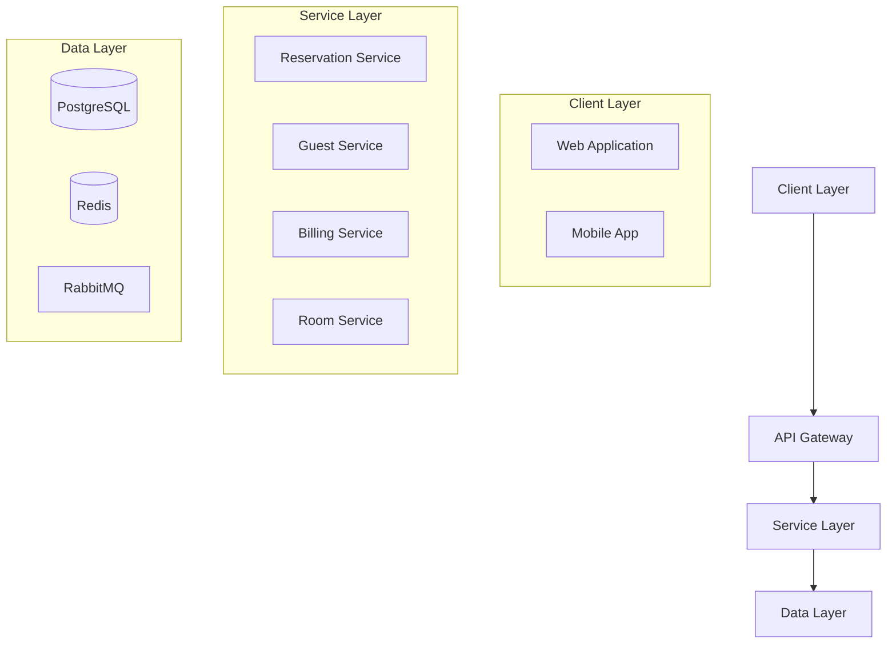

# Hotel Management ERP Front Office Module


## Overview

The Hotel Management ERP Front Office Module is an enterprise-grade software solution designed to modernize and streamline hotel operations through comprehensive digital transformation. This system provides integrated management of room inventory, guest services, and operational workflows while delivering real-time business insights.

### Key Features

- Real-time room inventory and dynamic pricing management
- Integrated guest services and digital check-in/out
- Multi-channel distribution system integration
- Automated night audit and financial reconciliation
- Comprehensive reporting and analytics dashboard
- Enterprise-grade security and compliance measures

### Technology Stack

- **Frontend**: React.js with TypeScript
- **Mobile**: React Native
- **Backend**: Node.js (v18 LTS)
- **Database**: PostgreSQL 13+
- **Cache**: Redis 7+
- **Message Queue**: RabbitMQ
- **Container Orchestration**: Kubernetes (AWS EKS)
- **CI/CD**: GitHub Actions, ArgoCD

## Getting Started

### Prerequisites

- Node.js 18 LTS
- Docker 24+
- Kubernetes 1.24+
- AWS CLI 2.0+
- Git 2.40+

### Development Environment Setup

1. Clone the repository:
```bash
git clone https://github.com/your-org/hotel-management-erp.git
cd hotel-management-erp
```

2. Install dependencies:
```bash
pnpm install
```

3. Configure environment variables:
```bash
cp .env.example .env
# Edit .env with your configuration
```

4. Start development environment:
```bash
docker-compose up -d
pnpm dev
```

### Architecture Overview



## Development Guidelines

### Code Structure

```
hotel-management-erp/
├── src/
│   ├── backend/         # Backend services
│   ├── web/            # Web frontend
│   ├── mobile/         # Mobile application
│   └── shared/         # Shared utilities
├── infrastructure/     # Infrastructure as code
├── docs/              # Documentation
└── tests/             # Test suites
```

### Coding Standards

- Follow TypeScript strict mode guidelines
- Implement comprehensive error handling
- Write unit tests for all business logic
- Document all public APIs using OpenAPI 3.0
- Follow Git commit message conventions

### Testing Requirements

- Unit tests: Jest
- Integration tests: Cypress
- API tests: Postman/Newman
- Mobile tests: Detox
- Minimum coverage: 80%

## Deployment

### Environment Configuration

| Environment | Purpose | Infrastructure |
|-------------|---------|----------------|
| Development | Local development | Docker Compose |
| Staging | Integration testing | AWS EKS |
| Production | Live system | AWS EKS + On-premises |

### Deployment Process

1. Automated CI/CD pipeline triggers on merge to main
2. Runs test suites and security scans
3. Builds Docker images and pushes to registry
4. Updates Kubernetes manifests
5. ArgoCD syncs changes to clusters
6. Automated smoke tests verify deployment

## Security

### Authentication & Authorization

- OAuth 2.0 + JWT for API authentication
- Role-based access control (RBAC)
- Multi-factor authentication for admin access
- Regular security audits and penetration testing

### Data Protection

- Encryption at rest using AES-256
- TLS 1.3 for data in transit
- PCI DSS compliance for payment processing
- GDPR compliance for data privacy

## Contributing

### Pull Request Process

1. Create feature branch from development
2. Implement changes following coding standards
3. Add/update tests and documentation
4. Submit PR with detailed description
5. Pass code review and automated checks
6. Merge after approval

### Release Process

1. Version bump following semver
2. Generate changelog
3. Create release branch
4. Deploy to staging for validation
5. Tag release and deploy to production
6. Monitor deployment health

## Support

### Troubleshooting

- Check system status: [status.hotel-erp.com](https://status.hotel-erp.com)
- Review logs in Grafana/Kibana
- Consult error code documentation
- Contact support team

### Contact Information

- Technical Support: support@hotel-erp.com
- Emergency Hotline: +1-555-0123
- Documentation: [docs.hotel-erp.com](https://docs.hotel-erp.com)

## License

This project is proprietary software. All rights reserved.

---
Last updated: [Dynamic Date]
Maintained by: Development Team