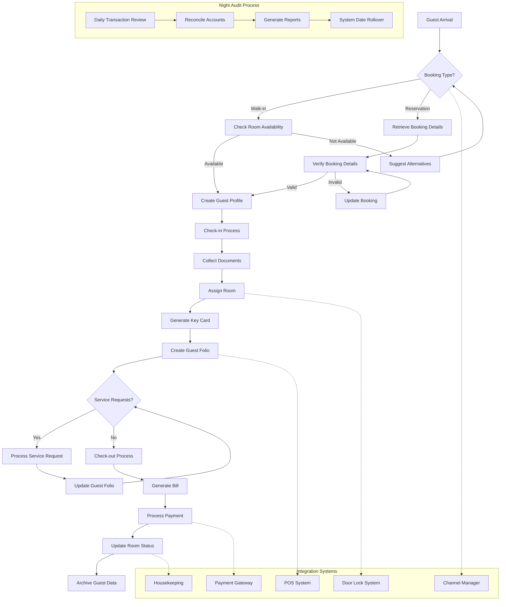
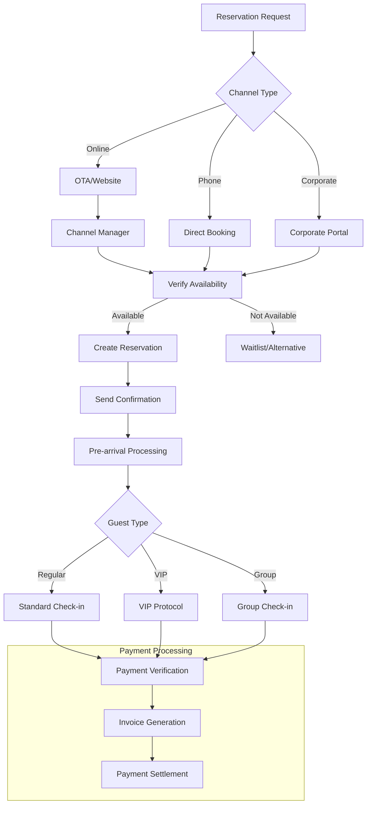
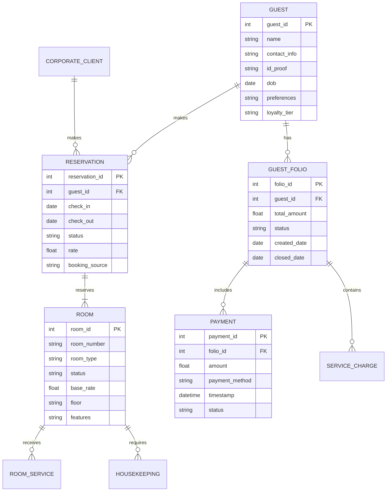
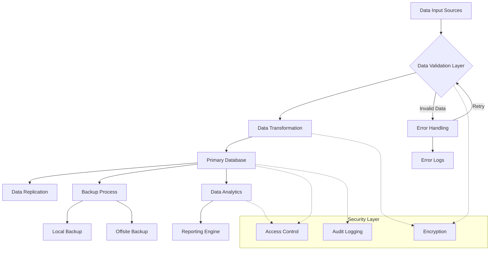
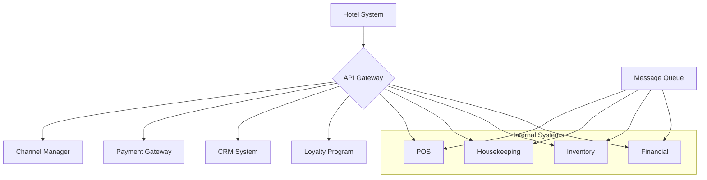
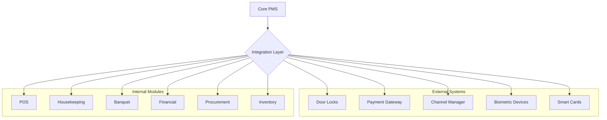

# Product Requirements Document (PRD)

# 1. INTRODUCTION

## 1.1 Purpose
This Software Requirements Specification (SRS) document provides a comprehensive description of the Hotel Management ERP Front Office Module. It details the functional and non-functional requirements for developers, project managers, testers, and stakeholders involved in the development and implementation process. The document serves as the primary reference for technical and non-technical audiences to understand the system's intended behavior and features.

## 1.2 Scope
The Hotel Management ERP Front Office Module is a comprehensive software solution designed to streamline and automate hotel operations. The system encompasses:

- Room Management
  - Room rack display
  - Room booking and reservation
  - Check-in/check-out processing
  - Group booking management
  
- Guest Services
  - Guest history tracking
  - Room service management
  - Guest folio maintenance
  - Corporate guest handling
  
- Financial Operations
  - Billing and invoicing
  - Corporate accounting
  - Night audit processing
  
- Integration Capabilities
  - Online booking engine
  - Channel manager integration
  - Payment gateway connectivity
  - Door lock systems
  - Biometric devices
  
- Reporting and Analytics
  - Occupancy reports
  - Revenue analysis
  - Guest statistics
  - Corporate client tracking

The system aims to enhance operational efficiency, improve guest satisfaction, and provide real-time insights for decision-making while maintaining seamless integration with other hotel management modules including POS, Housekeeping, Banquet Management, and Financial Management.

# 2. PRODUCT DESCRIPTION

## 2.1 Product Perspective
The Hotel Management ERP Front Office Module operates as a central component within the comprehensive hotel management ecosystem. It interfaces with multiple integrated systems:

- External Systems
  - Online Travel Agencies (OTAs) via Channel Manager
  - Payment Gateway Services
  - Door Lock Systems
  - Biometric Devices
  - Smart Card Systems
  - Mobile Check-in Applications

- Internal Modules
  - POS System for restaurants and services
  - Housekeeping Management
  - Banquet Management
  - Financial Management
  - Procurement System
  - Inventory Management
  - CRM System
  - Payroll Processing

## 2.2 Product Functions
The core functions of the system include:

1. Reservation Management
   - Real-time room availability tracking
   - Multi-channel booking processing
   - Rate management and package creation
   - Group booking handling

2. Front Desk Operations
   - Guest check-in/check-out processing
   - Room assignment and modifications
   - Key card generation and management
   - Guest profile management

3. Billing and Financial Processing
   - Automated billing generation
   - Split billing capabilities
   - Multiple payment method support
   - Corporate billing management
   - Night audit processing

4. Guest Service Management
   - Room service request tracking
   - Complaint management
   - Guest history maintenance
   - Loyalty program integration

## 2.3 User Characteristics
The system caters to various user types:

1. Front Desk Staff
   - Basic computer literacy required
   - Training needed for system operations
   - High interaction with guest-facing features

2. Management Personnel
   - Advanced system knowledge required
   - Access to analytical and reporting features
   - Configuration and control capabilities

3. Corporate Clients
   - Basic system interaction through portal
   - Booking and billing access
   - Limited feature access

4. Hotel Guests
   - Minimal technical knowledge required
   - Access through mobile app or web portal
   - Self-service features

## 2.4 Constraints

1. Technical Constraints
   - Must operate on existing hotel network infrastructure
   - Required compatibility with legacy door lock systems
   - Integration limitations with third-party systems
   - Real-time synchronization requirements

2. Regulatory Constraints
   - Compliance with local hotel regulations
   - Data protection and privacy laws
   - Financial reporting requirements
   - Guest information storage regulations

3. Operational Constraints
   - 24/7 system availability requirement
   - Maximum system downtime limitations
   - Backup and recovery time objectives
   - Training requirements for staff

## 2.5 Assumptions and Dependencies

### Assumptions
1. Stable internet connectivity available
2. Staff capable of basic computer operations
3. Adequate hardware infrastructure in place
4. Regular system maintenance windows available

### Dependencies
1. Third-party service availability
   - Payment gateway services
   - Channel manager systems
   - OTA connections
   
2. Hardware Dependencies
   - Door lock system compatibility
   - Biometric device functionality
   - POS terminal operations
   
3. Software Dependencies
   - Operating system compatibility
   - Database management system
   - Network security systems
   - Backup systems

# 3. PROCESS FLOWCHART

# 4. FUNCTIONAL REQUIREMENTS

## 4.1 Room Management

| ID | Description | Priority |
|---|---|---|
| RM-01 | Real-time room rack display showing room status (vacant, occupied, blocked, under maintenance) | High |
| RM-02 | Room type and rate management with dynamic pricing capabilities | High |
| RM-03 | Room blocking functionality for maintenance or VIP guests | Medium |
| RM-04 | Room change/swap functionality with automatic billing transfer | Medium |
| RM-05 | Room history tracking including maintenance records and guest complaints | Low |

## 4.2 Reservation Management

| ID | Description | Priority |
|---|---|---|
| RES-01 | Multi-channel reservation processing (direct, OTA, corporate portal) | High |
| RES-02 | Group booking management with room block allocation | High |
| RES-03 | Waitlist management and automatic notification system | Medium |
| RES-04 | Cancellation and modification handling with configurable policies | High |
| RES-05 | Advanced deposit and guarantee management | Medium |

## 4.3 Guest Management

| ID | Description | Priority |
|---|---|---|
| GM-01 | Guest profile creation and management with history tracking | High |
| GM-02 | VIP guest handling with special requests and preferences | Medium |
| GM-03 | Guest document scanning and storage | High |
| GM-04 | Integration with loyalty program | Medium |
| GM-05 | Guest feedback and complaint management system | Medium |

## 4.4 Billing and Payments

| ID | Description | Priority |
|---|---|---|
| BP-01 | Flexible billing with split payment options | High |
| BP-02 | Multiple payment method support (cash, card, digital wallets) | High |
| BP-03 | Corporate billing with credit limit management | High |
| BP-04 | Automatic tax calculation and GST compliance | High |
| BP-05 | Integration with payment gateway for online transactions | High |

## 4.5 Night Audit

| ID | Description | Priority |
|---|---|---|
| NA-01 | Automated daily transaction reconciliation | High |
| NA-02 | Day-end reports generation | High |
| NA-03 | System date rollover with automatic backups | High |
| NA-04 | Revenue posting verification | High |
| NA-05 | Guest credit limit checking | Medium |

## 4.6 Integration Features

| ID | Description | Priority |
|---|---|---|
| INT-01 | Door lock system integration for key card management | High |
| INT-02 | Channel manager integration for OTA bookings | High |
| INT-03 | POS system integration for F&B charges | High |
| INT-04 | Housekeeping module integration for room status | High |
| INT-05 | Biometric device integration for staff attendance | Medium |

## 4.7 Reporting and Analytics

| ID | Description | Priority |
|---|---|---|
| RA-01 | Occupancy and revenue reports | High |
| RA-02 | Guest history and preference analysis | Medium |
| RA-03 | Corporate client performance tracking | Medium |
| RA-04 | Daily, weekly, monthly business analysis | High |
| RA-05 | Custom report generation capability | Medium |

# 5. NON-FUNCTIONAL REQUIREMENTS

## 5.1 Performance Requirements

| ID | Requirement | Target Metric |
|---|---|---|
| PERF-01 | System response time for room availability check | < 2 seconds |
| PERF-02 | Check-in/check-out process completion time | < 3 minutes |
| PERF-03 | Maximum concurrent users supported | 500 users |
| PERF-04 | Database query response time | < 1 second |
| PERF-05 | Report generation time | < 30 seconds |
| PERF-06 | Payment gateway transaction processing | < 5 seconds |
| PERF-07 | Data synchronization with channel manager | < 1 minute |

## 5.2 Safety Requirements

| ID | Requirement | Description |
|---|---|---|
| SAF-01 | Automated data backup | Hourly incremental, daily full backup |
| SAF-02 | System redundancy | Hot standby server with automatic failover |
| SAF-03 | Transaction rollback | Automatic rollback for incomplete transactions |
| SAF-04 | Data recovery point objective (RPO) | < 1 hour data loss in case of failure |
| SAF-05 | Recovery time objective (RTO) | < 4 hours system restoration |

## 5.3 Security Requirements

| ID | Requirement | Description |
|---|---|---|
| SEC-01 | User authentication | Multi-factor authentication for staff access |
| SEC-02 | Role-based access control | Granular permission system for different user roles |
| SEC-03 | Data encryption | AES-256 encryption for data at rest and in transit |
| SEC-04 | Audit logging | Comprehensive logging of all system activities |
| SEC-05 | Session management | Automatic timeout after 15 minutes of inactivity |
| SEC-06 | Password policy | Complex passwords with 90-day expiration |
| SEC-07 | Guest data privacy | GDPR and local privacy law compliance |

## 5.4 Quality Requirements

### 5.4.1 Availability
- System uptime: 99.9% excluding planned maintenance
- Planned maintenance window: 2 AM - 4 AM local time
- Maximum unplanned downtime: 4 hours per month

### 5.4.2 Maintainability
- Modular architecture for easy updates
- Automated deployment process
- Configuration changes without system restart
- Comprehensive system documentation
- Regular security patch updates

### 5.4.3 Usability
- Intuitive user interface with consistent design
- Maximum 2 hours training required for basic operations
- Multi-language support (minimum 3 languages)
- Context-sensitive help system
- Mobile-responsive interface

### 5.4.4 Scalability
- Horizontal scaling capability up to 1000 rooms
- Support for multiple property management
- Dynamic resource allocation
- Load balancing capability
- Database partitioning support

### 5.4.5 Reliability
- Mean time between failures (MTBF): > 720 hours
- Error rate: < 0.1% for all transactions
- Data consistency check mechanisms
- Automated system health monitoring
- Fault tolerance for critical components

## 5.5 Compliance Requirements

| ID | Requirement | Description |
|---|---|---|
| COMP-01 | Data protection | GDPR, CCPA, and local data protection laws |
| COMP-02 | Financial compliance | SOX, PCI DSS for payment processing |
| COMP-03 | Accessibility | WCAG 2.1 Level AA compliance |
| COMP-04 | Industry standards | ISO/IEC 27001 for information security |
| COMP-05 | Local regulations | Hotel industry specific regulations |
| COMP-06 | Tax compliance | GST and local tax regulations |
| COMP-07 | Audit requirements | Support for internal and external audits |

# 6. DATA REQUIREMENTS

## 6.1 Data Models

## 6.2 Data Storage

### 6.2.1 Storage Requirements
- Primary Database: PostgreSQL 13+ for transactional data
- Document Store: MongoDB for guest documents and unstructured data
- File Storage: Object storage for scanned documents and images
- Cache Layer: Redis for session management and frequent lookups

### 6.2.2 Data Retention
- Guest Profiles: 7 years after last stay
- Financial Records: 10 years (compliance requirement)
- Operational Data: 3 years
- Audit Logs: 5 years
- Backup Data: 1 year rolling retention

### 6.2.3 Backup Strategy
- Real-time replication to standby database
- Hourly incremental backups
- Daily full backups
- Weekly offsite backup transfer
- Monthly backup verification and restoration testing

### 6.2.4 Recovery Procedures
- Point-in-time recovery capability
- Automated failover to standby database
- Transaction log shipping
- Cross-region disaster recovery setup
- Maximum 4-hour recovery time objective

## 6.3 Data Processing

### 6.3.1 Data Security
- AES-256 encryption for data at rest
- TLS 1.3 for data in transit
- Field-level encryption for sensitive data
- Tokenization for payment information
- Data masking for non-production environments

### 6.3.2 Data Validation
- Input validation at application and database levels
- Data type and format verification
- Business rule validation
- Referential integrity checks
- Duplicate detection

### 6.3.3 Data Integration
- Real-time synchronization with POS systems
- Batch processing for financial reconciliation
- Event-driven integration with external systems
- API-based data exchange with channel managers
- ETL processes for reporting and analytics

### 6.3.4 Data Archival
- Automated archival based on retention policies
- Compressed storage for archived data
- Searchable archive database
- Compliance-driven archival processes
- Secure archive destruction procedures

# 7. EXTERNAL INTERFACES

## 7.1 User Interfaces

### 7.1.1 General Requirements
- Modern, responsive web interface using React.js framework
- Mobile-first design approach
- Consistent color scheme and branding
- Minimum resolution support: 1366x768
- Support for touch interfaces
- Dark mode support
- Accessibility compliance (WCAG 2.1 Level AA)

### 7.1.2 Key Interface Components

| Interface | Description | Primary Users |
|---|---|---|
| Front Desk Dashboard | Real-time room status, arrivals/departures, notifications | Front desk staff |
| Reservation Calendar | Visual calendar with drag-drop booking management | Reservation staff |
| Guest Portal | Self-service interface for bookings and requests | Hotel guests |
| Management Console | Analytics, reports, and system configuration | Management |
| Housekeeping Interface | Mobile-optimized interface for room status updates | Housekeeping staff |

## 7.2 Hardware Interfaces

### 7.2.1 Door Lock System
- Protocol: RS-485/TCP-IP
- Data Format: Proprietary binary
- Interface Type: Serial/Ethernet
- Supported Systems: RFID, Magnetic Strip, Smart Card

### 7.2.2 Biometric Devices
- Connection: USB/TCP-IP
- Data Format: ISO/IEC 19794-2
- Supported Features: Fingerprint, Face Recognition
- Resolution: Minimum 500 DPI

### 7.2.3 POS Hardware
- Receipt Printers: ESC/POS protocol
- Card Readers: EMV compliant
- Cash Drawers: 24V DC interface
- Barcode Scanners: USB HID compliant

## 7.3 Software Interfaces

### 7.3.1 External Systems Integration

| System | Protocol | Data Format | Frequency |
|---|---|---|---|
| Channel Manager | REST API | JSON | Real-time |
| Payment Gateway | HTTPS | XML/JSON | Real-time |
| Accounting System | Web Services | XML | Daily batch |
| CRM System | REST API | JSON | Real-time |
| Loyalty Program | GraphQL | JSON | Real-time |

### 7.3.2 Internal Module Integration

| Module | Integration Type | Data Exchange |
|---|---|---|
| POS System | Microservices | Event-driven |
| Housekeeping | REST API | Real-time |
| Inventory | Message Queue | Near real-time |
| Financial | Database Link | Batch processing |
| Procurement | REST API | Real-time |

## 7.4 Communication Interfaces

### 7.4.1 Network Requirements
- Primary Protocol: TCP/IP
- Minimum Bandwidth: 10 Mbps dedicated
- VPN Support: IPSec/SSL
- Network Security: TLS 1.3
- Firewall Configuration: Application-aware

### 7.4.2 Communication Protocols

| Protocol | Usage | Security |
|---|---|---|
| HTTPS | Web Services | TLS 1.3 |
| MQTT | IoT Devices | TLS/SSL |
| WebSocket | Real-time Updates | WSS |
| SMTP | Email Notifications | STARTTLS |
| AMQP | Message Queue | TLS |

### 7.4.3 API Specifications
- REST API: OpenAPI 3.0 specification
- Authentication: OAuth 2.0/JWT
- Rate Limiting: 1000 requests/minute
- Response Format: JSON
- API Versioning: URI-based
- Documentation: Swagger/OpenAPI

### 7.4.4 Integration Patterns

# 8. APPENDICES

## 8.1 GLOSSARY

| Term | Definition |
|---|---|
| ARR | Average Room Rate - The average revenue earned per occupied room |
| Channel Manager | Software that manages hotel room inventory across multiple online booking platforms |
| Door Lock System | Electronic locking mechanism integrated with the hotel management system |
| Folio | Guest account that tracks all charges and payments during their stay |
| KOT | Kitchen Order Ticket - Order slip generated for kitchen staff |
| Night Audit | End-of-day process to reconcile all financial transactions |
| OTA | Online Travel Agency - Third-party websites selling hotel rooms |
| Room Rack | Visual representation of hotel room status and occupancy |
| Walk-in | Guests who arrive without prior reservation |

## 8.2 ACRONYMS

| Acronym | Expansion |
|---|---|
| API | Application Programming Interface |
| CRM | Customer Relationship Management |
| ERP | Enterprise Resource Planning |
| GDPR | General Data Protection Regulation |
| GST | Goods and Services Tax |
| PCI DSS | Payment Card Industry Data Security Standard |
| PMS | Property Management System |
| POS | Point of Sale |
| RFID | Radio Frequency Identification |
| SRS | Software Requirements Specification |
| TLS | Transport Layer Security |
| VIP | Very Important Person |
| WCAG | Web Content Accessibility Guidelines |

## 8.3 ADDITIONAL REFERENCES

| Reference | Description | URL/Location |
|---|---|---|
| HTNG Standards | Hospitality Technology Next Generation technical specifications | www.htng.org |
| ISO/IEC 27001 | Information security management standards | www.iso.org |
| OpenTravel Alliance | Travel industry integration standards | www.opentravel.org |
| PCI Security Standards | Payment card industry security requirements | www.pcisecuritystandards.org |
| HFTP USALI | Uniform System of Accounts for Lodging Industry | www.hftp.org |

## 8.4 INTEGRATION SPECIFICATIONS

