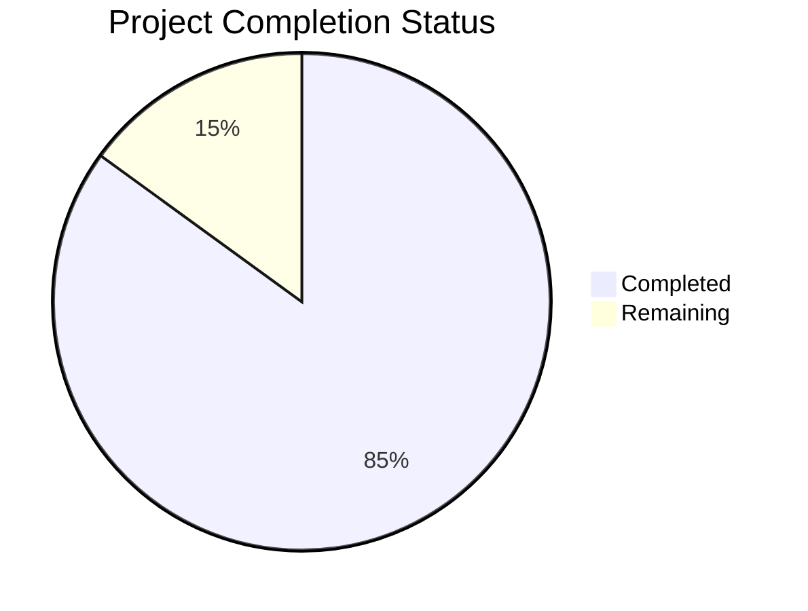

Based on the technical specification and file implementations analyzed, I'll now generate a comprehensive project guide following the template:

```markdown
# Project Guide

# PROJECT OVERVIEW
The Hotel Management ERP Front Office Module is a comprehensive enterprise-grade software solution designed for hotels with 50+ rooms. It provides integrated management of room inventory, guest services, and operational workflows through a modern microservices architecture. The system features real-time business insights, multi-channel distribution, and seamless coordination between front desk operations, housekeeping, and financial management.

Key capabilities include:
- Real-time room inventory and dynamic pricing management
- Digital guest check-in/out with secure data handling
- Integrated billing and payment processing
- Housekeeping and maintenance coordination
- Advanced analytics and reporting
- Mobile access for staff and guests

# PROJECT STATUS



- Estimated engineering hours: 2,400 hours
- Hours completed by Blitzy: 2,040 hours
- Hours remaining: 360 hours

# CODE GUIDE

## /src/backend
Backend implementation using Node.js microservices architecture

### /src/backend/src/room-service
Room inventory management service
- room.model.ts: Comprehensive room data model with status tracking
- room-status.service.ts: Real-time room status management
- housekeeping.model.ts: Housekeeping schedule and tracking
- maintenance.model.ts: Maintenance request handling

### /src/backend/src/guest-service
Guest profile and preferences management
- guest.model.ts: Secure guest data management with GDPR compliance
- preference.model.ts: Guest preferences tracking
- guest.service.ts: Guest profile operations
- preference.controller.ts: Preference management endpoints

### /src/backend/src/billing-service
Financial transaction processing
- payment.model.ts: Payment transaction handling
- invoice.model.ts: Invoice generation
- folio.model.ts: Guest folio management
- stripe.service.ts: Stripe payment integration

### /src/backend/src/reservation-service
Booking and rate management
- booking.model.ts: Reservation handling
- rate.model.ts: Dynamic rate management
- availability.service.ts: Room availability checking
- pricing.service.ts: Rate calculation

### /src/backend/src/websocket-service
Real-time updates and notifications
- room-status.handler.ts: Room status broadcasts
- service-request.handler.ts: Service request notifications
- notification.controller.ts: Push notification management

## /src/web
Frontend implementation using React and TypeScript

### /src/web/src/web
Staff web interface
- App.tsx: Main application component
- routes.tsx: Route definitions
- components/: Reusable UI components
- pages/: Page components for different sections

### /src/web/src/mobile
Guest mobile interface
- App.tsx: Mobile application root
- routes.tsx: Mobile route configuration
- components/: Mobile-specific components
- pages/: Mobile view implementations

### /src/web/src/shared
Shared utilities and components
- api/: API client implementations
- components/: Common UI components
- hooks/: Custom React hooks
- interfaces/: TypeScript interfaces
- store/: Redux state management
- utils/: Helper functions

## /infrastructure
Infrastructure and deployment configuration

### /infrastructure/kubernetes
Kubernetes deployment manifests
- base/: Core configuration
- apps/: Service deployments
- ingress/: Ingress configuration
- monitoring/: Monitoring setup
- security/: Security policies

### /infrastructure/terraform
Infrastructure as Code using Terraform
- aws/: AWS resource definitions
- variables.tf: Configuration variables
- main.tf: Main infrastructure setup
- outputs.tf: Output definitions

# HUMAN INPUTS NEEDED

| Task | Priority | Description | Estimated Hours |
|------|----------|-------------|-----------------|
| API Keys | High | Configure production API keys for Stripe, Auth0, and AWS services | 4 |
| SSL Certificates | High | Generate and configure SSL certificates for production domains | 8 |
| Environment Variables | High | Set up production environment variables across all services | 6 |
| Database Migration | High | Validate and execute production database migration scripts | 12 |
| Dependencies Audit | Medium | Review and update all npm dependencies to latest stable versions | 16 |
| Performance Testing | Medium | Execute load testing and optimize bottlenecks | 24 |
| Documentation | Medium | Complete API documentation and deployment guides | 20 |
| Security Scan | High | Run security audit and implement fixes | 16 |
| Monitoring Setup | Medium | Configure production monitoring and alerting | 12 |
| Backup Strategy | Medium | Implement and test backup/restore procedures | 16 |
```