# Technical Specifications

# 1. INTRODUCTION

## 1.1 Executive Summary

The Hotel Management ERP Front Office Module is a comprehensive software solution designed to modernize and streamline hotel operations through digital transformation. This system addresses the critical need for integrated management of room inventory, guest services, and operational workflows while providing real-time business insights. The solution targets mid to large-scale hotels requiring seamless coordination between front desk operations, housekeeping, food services, and financial management. By implementing this system, hotels can expect improved operational efficiency, enhanced guest satisfaction, and increased revenue through optimized resource utilization.

## 1.2 System Overview

### Project Context

| Aspect | Description |
|--------|-------------|
| Market Position | Enterprise-grade hotel management solution for properties with 50+ rooms |
| Current Limitations | Manual processes, disconnected systems, delayed reporting, limited guest insights |
| Enterprise Integration | Seamless connectivity with existing POS, accounting, and CRM systems |

### High-Level Description

| Component | Capabilities |
|-----------|-------------|
| Room Management | Real-time inventory, dynamic pricing, multi-channel distribution |
| Guest Services | Digital check-in/out, service requests, folio management |
| Operations | Housekeeping coordination, maintenance tracking, service delivery |
| Financial | Integrated billing, payment processing, night audit automation |
| Analytics | Real-time dashboards, predictive occupancy, revenue optimization |

### Success Criteria

| KPI Category | Metrics |
|--------------|---------|
| Operational | 50% reduction in check-in time, 99.9% system uptime |
| Financial | 15% revenue increase, 30% reduction in operational costs |
| Guest Experience | 25% improvement in guest satisfaction scores |
| Staff Efficiency | 40% reduction in manual data entry, 60% faster reporting |

## 1.3 Scope

### In-Scope Elements

| Category | Components |
|----------|------------|
| Core Features | Room management, reservations, guest services, billing |
| User Workflows | Front desk operations, housekeeping, night audit, reporting |
| Integrations | POS, payment gateways, channel managers, door locks |
| Technical Requirements | Multi-user support, real-time updates, mobile access |

### Implementation Boundaries

| Boundary Type | Coverage |
|---------------|----------|
| User Groups | Staff, management, guests, corporate clients |
| Geographic Coverage | Multi-property support with localization |
| Data Domains | Guest data, operational data, financial transactions |
| System Access | Web-based, mobile apps, kiosk interfaces |

### Out-of-Scope Elements

| Category | Excluded Items |
|----------|----------------|
| Features | Property maintenance management, staff payroll |
| Integrations | Building management systems, energy management |
| Use Cases | Conference center management, spa services |
| Future Phases | Customer loyalty program, vacation ownership |

# 2. SYSTEM ARCHITECTURE

## 2.1 High-Level Architecture

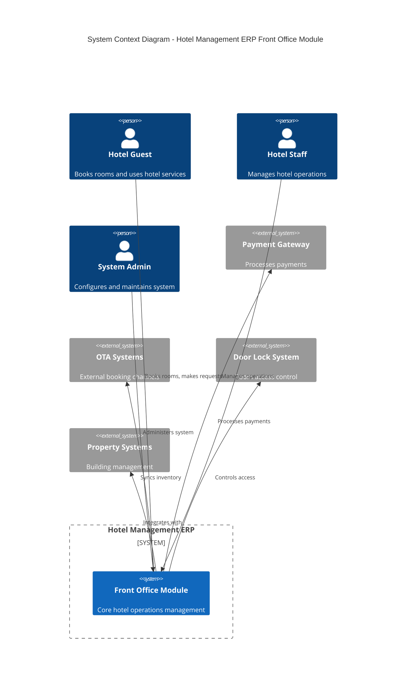

## 2.2 Container Architecture

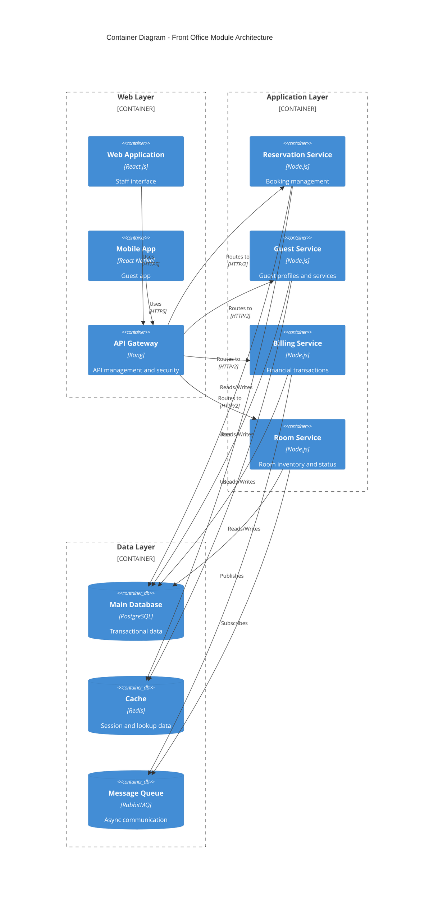

## 2.3 Component Details

### 2.3.1 Core Components

| Component | Technology | Purpose | Scaling Strategy |
|-----------|------------|---------|------------------|
| Web Application | React.js, TypeScript | Staff interface | Horizontal scaling with load balancer |
| Mobile App | React Native | Guest self-service | N/A (Client-side) |
| API Gateway | Kong | Request routing, auth | Cluster deployment |
| Reservation Service | Node.js, Express | Booking management | Horizontal pod autoscaling |
| Guest Service | Node.js, Express | Guest management | Horizontal pod autoscaling |
| Billing Service | Node.js, Express | Financial operations | Vertical scaling |
| Room Service | Node.js, Express | Inventory management | Horizontal pod autoscaling |

### 2.3.2 Data Flow Architecture

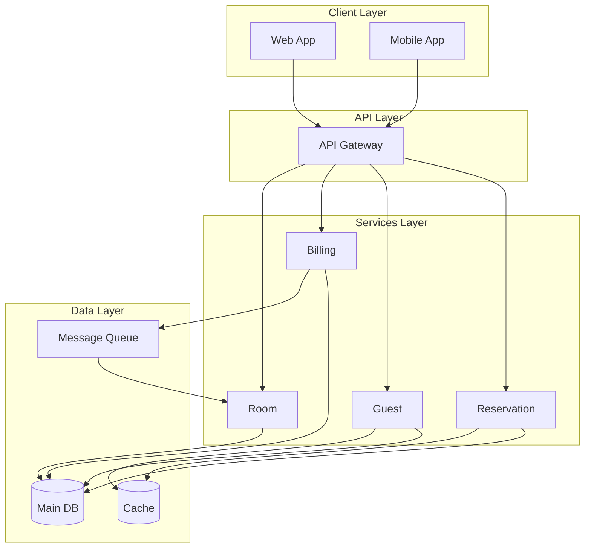

## 2.4 Technical Decisions

### 2.4.1 Architecture Patterns

| Pattern | Implementation | Justification |
|---------|---------------|---------------|
| Microservices | Domain-based services | Scalability, maintainability |
| Event-driven | RabbitMQ | Async operations, loose coupling |
| CQRS | Separate read/write models | Performance optimization |
| API Gateway | Kong | Security, routing, monitoring |
| Cache-Aside | Redis | Performance, scalability |

### 2.4.2 Deployment Architecture

```mermaid
C4Deployment
    title Deployment Diagram - Production Environment

    Deployment_Node(cdn, "CDN", "CloudFront") {
        Container(static, "Static Assets")
    }

    Deployment_Node(k8s, "Kubernetes Cluster") {
        Deployment_Node(web, "Web Tier") {
            Container(web_pods, "Web Pods")
        }
        Deployment_Node(app, "App Tier") {
            Container(app_pods, "Service Pods")
        }
        Deployment_Node(data, "Data Tier") {
            Container(db_pods, "Database Pods")
            Container(cache_pods, "Cache Pods")
            Container(queue_pods, "Queue Pods")
        }
    }

    Deployment_Node(storage, "Storage") {
        Container(pv, "Persistent Volumes")
    }

    Rel(cdn, web_pods, "Serves")
    Rel(web_pods, app_pods, "Uses")
    Rel(app_pods, db_pods, "Reads/Writes")
    Rel(app_pods, cache_pods, "Caches")
    Rel(app_pods, queue_pods, "Messages")
    Rel(db_pods, pv, "Stores")
```

## 2.5 Cross-Cutting Concerns

### 2.5.1 Monitoring and Observability

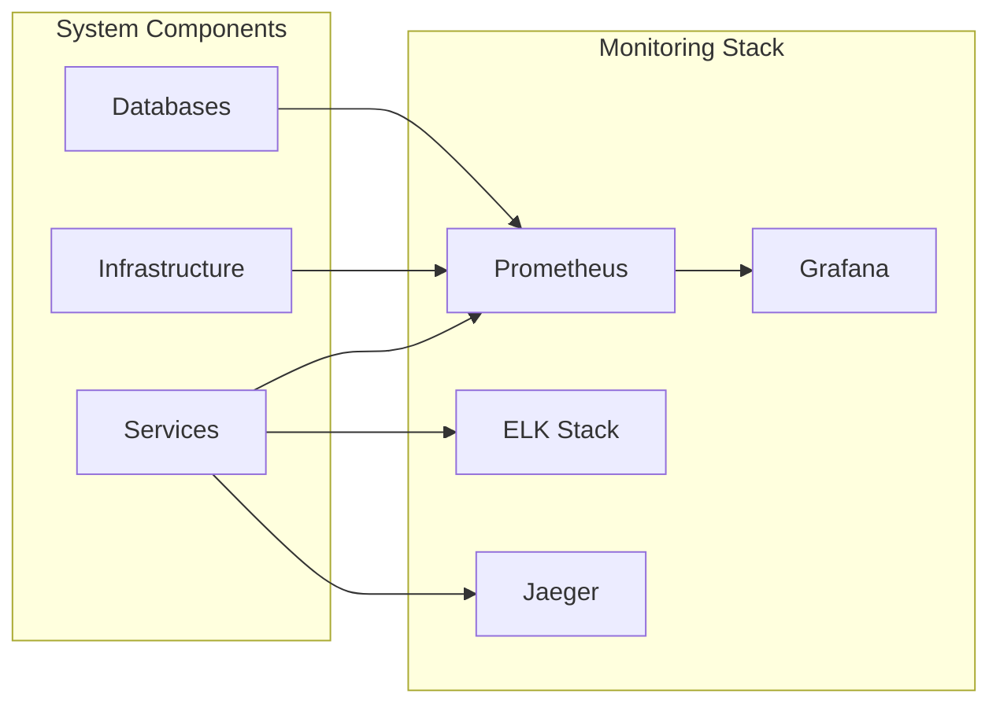

### 2.5.2 Security Architecture

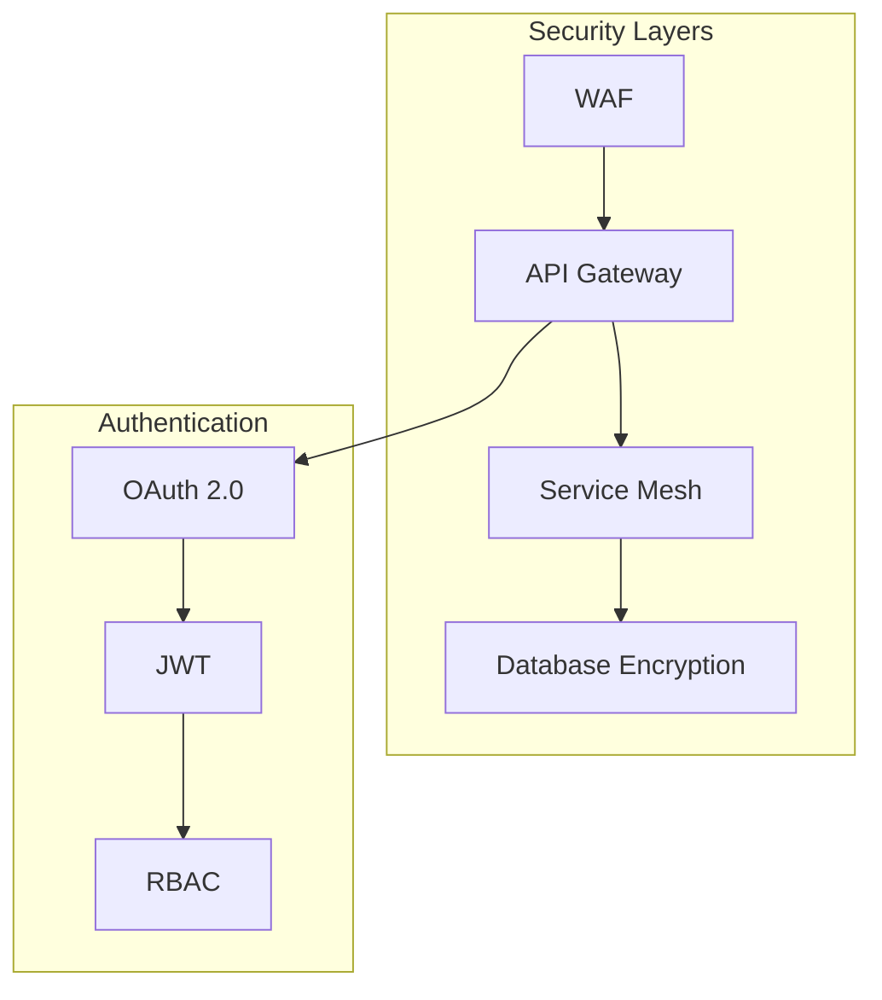

### 2.5.3 Error Handling and Recovery

| Component | Strategy | Recovery Time Objective |
|-----------|----------|------------------------|
| Database | Active-passive replication | < 5 minutes |
| Cache | Redis Sentinel | < 30 seconds |
| Message Queue | Clustered deployment | < 1 minute |
| Application | Circuit breakers, retries | Immediate |
| Load Balancer | Failover configuration | < 30 seconds |

# 3. SYSTEM COMPONENTS ARCHITECTURE

## 3.1 User Interface Design

### 3.1.1 Design System Specifications

| Component | Specification | Details |
|-----------|--------------|----------|
| Typography | Primary: Roboto | Headings: 16-32px, Body: 14-16px |
| Color Palette | Primary: #2C3E50 | Secondary: #3498DB, Accent: #E74C3C |
| Grid System | 12-column | Breakpoints: 576px, 768px, 992px, 1200px |
| Spacing | 8px base unit | Multiples: 8px, 16px, 24px, 32px, 48px |
| Shadows | 3 elevation levels | Light: 2px, Medium: 4px, Heavy: 8px |
| Icons | Material Design | Custom hotel-specific icon set |
| Accessibility | WCAG 2.1 AA | High contrast ratios, keyboard navigation |

### 3.1.2 Layout Structure

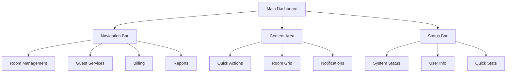

### 3.1.3 Critical User Flows

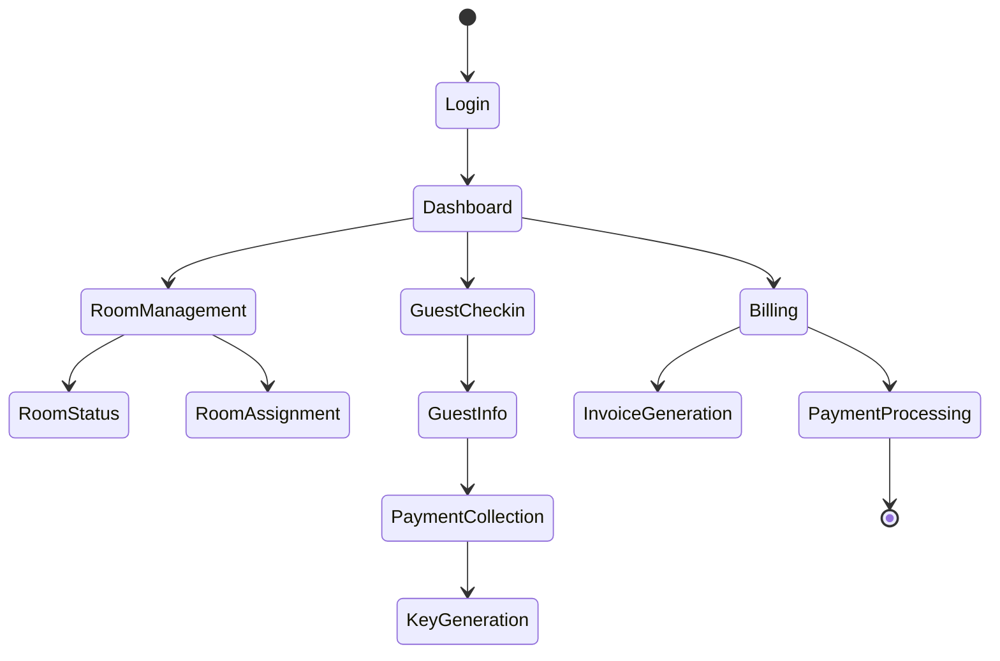

### 3.1.4 Responsive Design Requirements

| Breakpoint | Layout Adjustments | UI Components |
|------------|-------------------|---------------|
| Mobile (<576px) | Single column, stacked navigation | Collapsible menus, simplified room grid |
| Tablet (576-992px) | Two-column layout, sidebar navigation | Expandable panels, touch-optimized |
| Desktop (>992px) | Multi-column layout, full navigation | Advanced features, detailed room grid |

## 3.2 Database Design

### 3.2.1 Entity Relationship Diagram

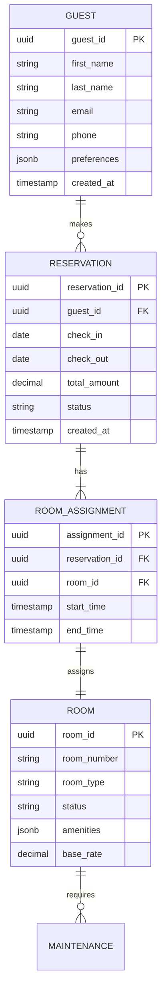

### 3.2.2 Data Management Strategy

| Aspect | Strategy | Implementation |
|--------|----------|----------------|
| Partitioning | Time-based | Monthly partitions for transactions |
| Indexing | B-tree, GiST | Covering indexes for common queries |
| Caching | Redis | 15-minute TTL for room availability |
| Replication | Master-slave | Async replication with 2 replicas |
| Backup | Incremental | Hourly backups with 30-day retention |
| Archival | Cold storage | Move data older than 2 years to archive |

## 3.3 API Design

### 3.3.1 API Architecture

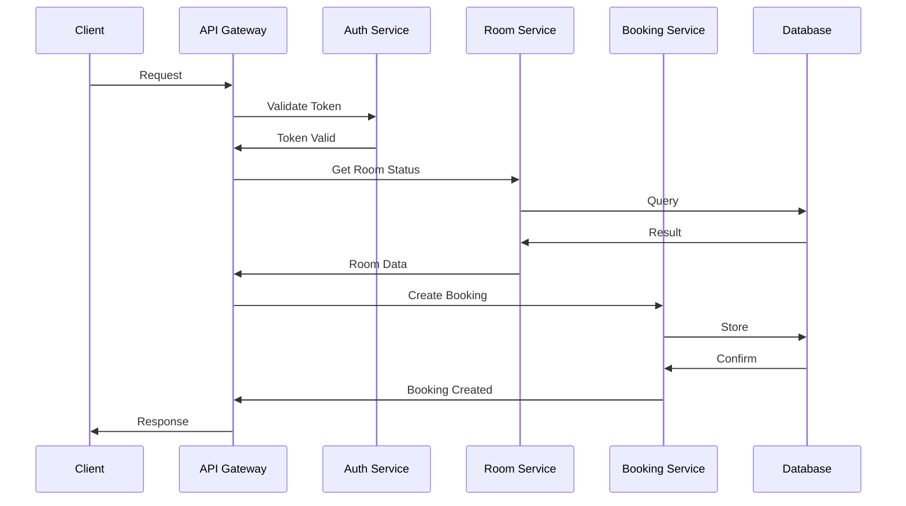

### 3.3.2 API Specifications

| Endpoint | Method | Purpose | Authentication |
|----------|--------|---------|----------------|
| /api/v1/rooms | GET | List rooms | JWT Bearer |
| /api/v1/reservations | POST | Create booking | JWT Bearer |
| /api/v1/guests | PUT | Update guest | JWT Bearer |
| /api/v1/billing | POST | Process payment | JWT Bearer + API Key |

### 3.3.3 Integration Patterns

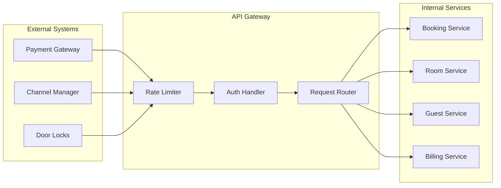

# 4. TECHNOLOGY STACK

## 4.1 PROGRAMMING LANGUAGES

| Platform | Language | Version | Justification |
|----------|----------|---------|---------------|
| Backend Services | Node.js | 18 LTS | Event-driven architecture support, extensive package ecosystem, proven performance for real-time applications |
| Frontend Web | TypeScript | 5.0+ | Type safety, enhanced IDE support, reduced runtime errors |
| Mobile Apps | React Native/TypeScript | 0.72+ | Code reuse across platforms, native performance |
| Database Scripts | SQL/PL/pgSQL | 13+ | Native PostgreSQL support, optimized query performance |
| DevOps | Python | 3.11+ | Automation scripts, deployment tools, monitoring integrations |

## 4.2 FRAMEWORKS & LIBRARIES

### 4.2.1 Backend Framework Stack

| Component | Technology | Version | Purpose |
|-----------|------------|---------|----------|
| Core Framework | Express.js | 4.18+ | RESTful API development, middleware support |
| API Documentation | OpenAPI/Swagger | 3.0 | API specification and documentation |
| Authentication | Passport.js | 0.6+ | Flexible authentication middleware |
| Validation | Joi | 17+ | Request validation and sanitization |
| ORM | Prisma | 5.0+ | Type-safe database access, migrations |
| Testing | Jest | 29+ | Unit and integration testing |

### 4.2.2 Frontend Framework Stack

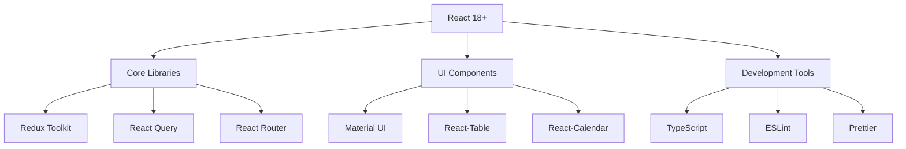

## 4.3 DATABASES & STORAGE

### 4.3.1 Database Architecture

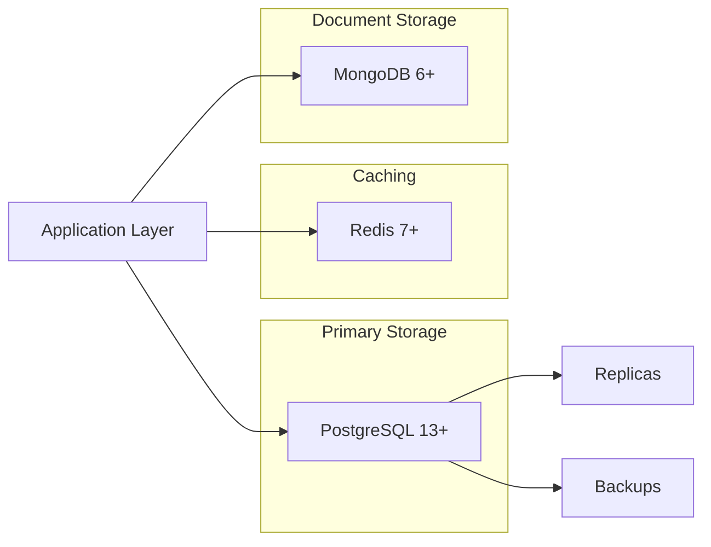

### 4.3.2 Storage Solutions

| Type | Technology | Purpose | Retention |
|------|------------|---------|-----------|
| RDBMS | PostgreSQL 13+ | Transactional data | Online: 2 years |
| Cache | Redis 7+ | Session, API cache | Volatile |
| Document | MongoDB 6+ | Guest documents | Online: 3 years |
| Object Storage | S3 Compatible | Media, exports | Archive: 7 years |
| Time Series | TimescaleDB | Metrics, analytics | Online: 1 year |

## 4.4 THIRD-PARTY SERVICES

### 4.4.1 External Integrations

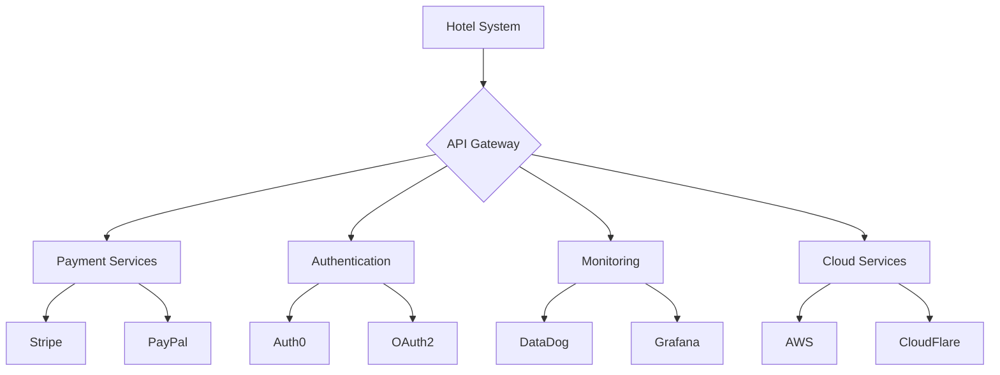

### 4.4.2 Service Matrix

| Category | Service | Purpose | SLA |
|----------|---------|---------|-----|
| Payment | Stripe | Payment processing | 99.99% |
| Authentication | Auth0 | Identity management | 99.99% |
| CDN | CloudFlare | Content delivery | 99.95% |
| Monitoring | DataDog | System monitoring | 99.9% |
| Email | SendGrid | Transactional email | 99.95% |

## 4.5 DEVELOPMENT & DEPLOYMENT

### 4.5.1 Development Environment

| Tool | Purpose | Version |
|------|---------|---------|
| VS Code | IDE | Latest |
| Docker | Containerization | 24+ |
| Git | Version control | 2.40+ |
| Node.js | Runtime | 18 LTS |
| pnpm | Package management | 8+ |

### 4.5.2 Deployment Pipeline

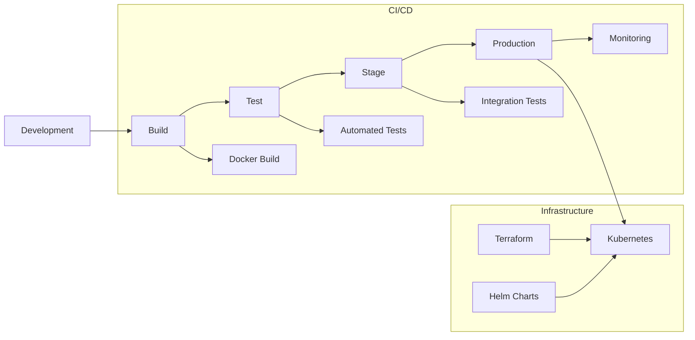

### 4.5.3 Infrastructure Requirements

| Component | Specification | Scaling |
|-----------|--------------|---------|
| API Servers | 4 vCPU, 16GB RAM | Horizontal |
| Database | 8 vCPU, 32GB RAM | Vertical |
| Cache | 4 vCPU, 16GB RAM | Cluster |
| Storage | SSD, 1000 IOPS | Expandable |
| Network | 10 Gbps | Load balanced |

# 5. SYSTEM DESIGN

## 5.1 User Interface Design

### 5.1.1 Layout Structure

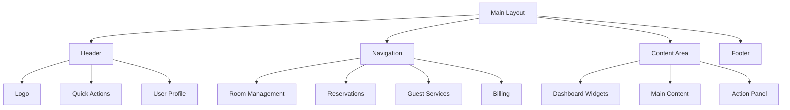

### 5.1.2 Core Screen Designs

| Screen | Primary Components | Key Features |
|--------|-------------------|--------------|
| Dashboard | Room Grid, Notifications, Quick Stats | Real-time updates, Drag-drop room assignments |
| Reservations | Calendar View, Booking Form, Room List | Multi-date selection, Rate display |
| Guest Profile | Guest Info, Stay History, Preferences | Document upload, Service history |
| Billing | Invoice Generator, Payment Form, Folio View | Split billing, Multi-currency support |

### 5.1.3 Responsive Breakpoints

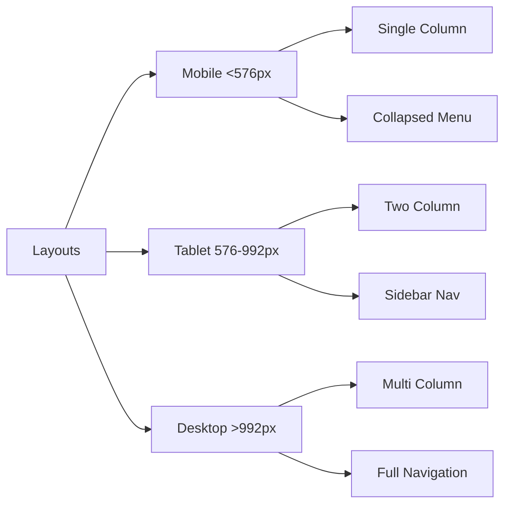

## 5.2 Database Design

### 5.2.1 Schema Design

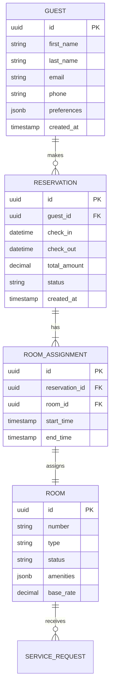

### 5.2.2 Data Storage Strategy

| Data Type | Storage Solution | Retention Policy |
|-----------|-----------------|------------------|
| Transactional | PostgreSQL | 2 years online |
| Documents | MongoDB | 3 years |
| Session Data | Redis | 24 hours |
| Audit Logs | TimescaleDB | 1 year |
| Media Files | S3 Compatible | 5 years |

## 5.3 API Design

### 5.3.1 REST Endpoints

| Endpoint | Method | Purpose | Authentication |
|----------|--------|---------|----------------|
| /api/v1/reservations | POST | Create booking | JWT |
| /api/v1/rooms/status | GET | Room availability | JWT |
| /api/v1/guests/{id} | PUT | Update guest | JWT |
| /api/v1/billing/checkout | POST | Process checkout | JWT + API Key |

### 5.3.2 API Architecture

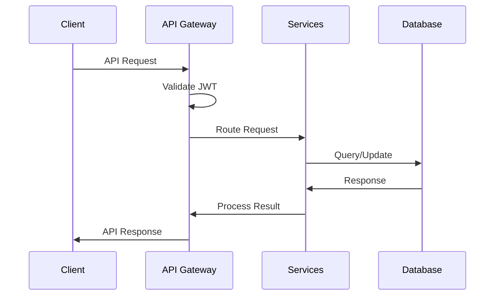

### 5.3.3 Integration Patterns

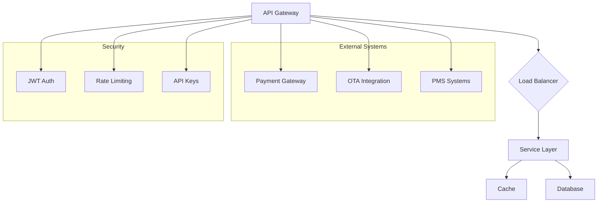

### 5.3.4 WebSocket Events

| Event | Direction | Purpose | Payload |
|-------|-----------|---------|---------|
| room.status | Server->Client | Room status update | Room ID, Status |
| reservation.created | Server->Client | New booking notification | Reservation details |
| guest.checkin | Server->Client | Guest arrival alert | Guest info |
| service.request | Client->Server | New service request | Request details |

# 6. USER INTERFACE DESIGN

## 6.1 Design System

| Element | Specification | Usage |
|---------|--------------|--------|
| Typography | Roboto (Primary), Open Sans (Secondary) | Headers: 24-32px, Body: 14-16px |
| Colors | Primary: #2C3E50, Secondary: #3498DB, Accent: #E74C3C | Navigation, Actions, Alerts |
| Spacing | Base unit: 8px | Margins/Padding: 8px, 16px, 24px, 32px |
| Breakpoints | Mobile: 576px, Tablet: 768px, Desktop: 992px | Responsive layouts |
| Shadows | Light: 2px, Medium: 4px, Deep: 8px | Cards, Modals, Dropdowns |

## 6.2 Core Screens

### 6.2.1 Dashboard
```
+----------------------------------------------------------+
|  [#] Hotel Management System               [@] Admin [=]   |
+----------------------------------------------------------+
|                                                           |
|  +----------------+ +----------------+ +----------------+  |
|  | OCCUPANCY      | | ARRIVALS       | | REVENUE        |  |
|  | [====75%====] | | Today: 12      | | $12,450       |  |
|  | 75/100 Rooms  | | Pending: 5     | | +15% [^]      |  |
|  +----------------+ +----------------+ +----------------+  |
|                                                           |
|  +--------------------------------------------------+   |
|  | ROOM STATUS                              [?] Help |   |
|  | +--------+ +--------+ +--------+ +--------+      |   |
|  | |101 [*] | |102    | |103 [!] | |104    |      |   |
|  | |OCC     | |VAC    | |MAINT   | |VAC    |      |   |
|  | +--------+ +--------+ +--------+ +--------+      |   |
|  +--------------------------------------------------+   |
|                                                           |
|  [Quick Actions]                                         |
|  [+] New Booking   [$] Payments   [i] Reports            |
+----------------------------------------------------------+
```

### 6.2.2 Reservation Form
```
+----------------------------------------------------------+
|  [<] Back to Dashboard         New Reservation            |
+----------------------------------------------------------+
|                                                           |
|  Guest Information:                                       |
|  Name:     [...........................]                  |
|  Email:    [...........................]                  |
|  Phone:    [...........................]                  |
|                                                           |
|  Booking Details:                                         |
|  Check-in:  [.../../....]  Check-out: [.../../....]      |
|                                                           |
|  Room Type: [v]                                          |
|  ( ) Standard    ( ) Deluxe    ( ) Suite                 |
|                                                          |
|  Add-ons:                                                |
|  [ ] Breakfast ($15/day)                                 |
|  [ ] Airport Transfer ($50)                              |
|  [ ] Late Check-out ($30)                                |
|                                                           |
|  Total: $450                                             |
|                                                           |
|  [Save Draft]              [Confirm Booking]              |
+----------------------------------------------------------+
```

### 6.2.3 Guest Check-in
```
+----------------------------------------------------------+
|  Check-in Process                     Booking #12345      |
+----------------------------------------------------------+
|                                                           |
|  +------------------------+  +------------------------+    |
|  | Guest Details         |  | Room Assignment        |    |
|  | John Doe             [i]|  | Room: 101 [v]        |    |
|  | johndoe@email.com      |  | Type: Deluxe          |    |
|  | +1-555-0123           |  | Floor: 1st            |    |
|  +------------------------+  +------------------------+    |
|                                                           |
|  Document Verification:                                   |
|  [^] Upload ID     [^] Upload Payment Card               |
|                                                           |
|  Key Card:                                               |
|  [Generate Key Card]   Status: Pending                    |
|                                                           |
|  Payment Status:                                         |
|  [====90%====] Authorized                                |
|                                                           |
|  [Cancel]                     [Complete Check-in]         |
+----------------------------------------------------------+
```

## 6.3 Component Library

### 6.3.1 Navigation Elements
```
Primary Navigation:
[#] Dashboard  [*] Rooms  [$] Billing  [@] Guests  [=] Settings

Secondary Navigation:
[<] Previous   |   Current View   |   [>] Next

Breadcrumbs:
Home > Reservations > New Booking
```

### 6.3.2 Common Controls
```
Buttons:
[Primary Action]   [Secondary Action]   [x] Cancel

Input Fields:
Text:     [...........................]
Number:   [123]
Date:     [MM/DD/YYYY]
Dropdown: [v]

Selection:
Single:   ( ) Option 1  ( ) Option 2  ( ) Option 3
Multiple: [ ] Option 1  [ ] Option 2  [ ] Option 3

Progress:
[====75%====]  Loading...
```

### 6.3.3 Alert Messages
```
+----------------------------------------------------------+
|  [!] Error: Required field missing                        |
+----------------------------------------------------------+

+----------------------------------------------------------+
|  [i] Info: Changes saved successfully                     |
+----------------------------------------------------------+

+----------------------------------------------------------+
|  [*] Success: Check-in completed                          |
+----------------------------------------------------------+
```

## 6.4 Interaction Patterns

### 6.4.1 Modal Dialogs
```
+----------------------------------------------------------+
|  Confirm Action                                    [x]    |
+----------------------------------------------------------+
|                                                           |
|  Are you sure you want to cancel this reservation?        |
|  This action cannot be undone.                            |
|                                                           |
|  [Cancel]                              [Confirm]          |
+----------------------------------------------------------+
```

### 6.4.2 Form Validation
```
+----------------------------------------------------------+
|  Field Validation:                                        |
|                                                           |
|  Name: [...........................]                      |
|  [!] This field is required                              |
|                                                           |
|  Email: [...........................]                     |
|  [!] Please enter a valid email address                  |
|                                                           |
|  Phone: [...........................]                     |
|  [i] Format: +1-XXX-XXX-XXXX                            |
+----------------------------------------------------------+
```

## 6.5 Responsive Behavior

### 6.5.1 Mobile View (< 576px)
```
+------------------+
| [=] Menu [@]    |
+------------------+
| Dashboard        |
|                 |
| +-------------+ |
| | Occupancy   | |
| | 75%        | |
| +-------------+ |
|                 |
| +-------------+ |
| | Arrivals    | |
| | Today: 12   | |
| +-------------+ |
|                 |
| [+] Quick Add   |
+------------------+
```

### 6.5.2 Tablet View (576px - 992px)
```
+--------------------------------+
| [#] HMS        [@] Admin [=]   |
+--------------------------------+
| +-----------+ +-----------+    |
| |Occupancy  | |Arrivals   |    |
| |75%        | |Today: 12  |    |
| +-----------+ +-----------+    |
|                                |
| +------------------------+     |
| |Room Grid               |     |
| |[101][102][103][104]   |     |
| +------------------------+     |
|                                |
| [Quick Actions]                |
+--------------------------------+
```

## 6.6 Icon Key
```
Navigation:
[#] - Dashboard/Home
[@] - User Profile
[=] - Settings Menu
[<] - Back/Previous
[>] - Forward/Next

Actions:
[+] - Add/Create New
[x] - Close/Delete
[$] - Payment/Financial
[^] - Upload
[v] - Dropdown

Status:
[!] - Warning/Alert
[i] - Information
[*] - Important/Featured
[?] - Help

Progress:
[====] - Progress Bar
(...) - Loading State
```

# 7. SECURITY CONSIDERATIONS

## 7.1 Authentication and Authorization

### 7.1.1 Authentication Methods

| Method | Use Case | Implementation |
|--------|----------|----------------|
| OAuth 2.0 + JWT | Staff & API Access | Auth0 with 2-hour token expiry |
| SAML 2.0 | Corporate Portal SSO | Integration with corporate identity providers |
| Biometric | Staff Time Clock | Fingerprint/facial via integrated hardware |
| API Keys | External System Integration | Rotating keys with 90-day expiry |
| MFA | Administrative Access | SMS/Authenticator app required |

### 7.1.2 Role-Based Access Control (RBAC)

```mermaid
flowchart TD
    A[User Login] --> B{Authentication}
    B -->|Success| C[Role Assignment]
    B -->|Failure| D[Access Denied]
    
    C --> E[Super Admin]
    C --> F[Hotel Manager]
    C --> G[Front Desk]
    C --> H[Housekeeping]
    
    E --> I[All Access]
    F --> J[Operations + Reports]
    G --> K[Guest + Booking]
    H --> L[Room Status]
    
    subgraph Audit
    M[Log Access]
    N[Monitor Sessions]
    O[Alert Triggers]
    end
    
    I & J & K & L --> M
    M --> N --> O
```

## 7.2 Data Security

### 7.2.1 Encryption Standards

| Data Type | At Rest | In Transit | Key Management |
|-----------|----------|------------|----------------|
| Guest PII | AES-256 | TLS 1.3 | AWS KMS |
| Payment Info | PCI DSS Compliant | TLS 1.3 | Hardware Security Module |
| Documents | AES-256 | TLS 1.3 | AWS KMS |
| Session Data | Redis Encryption | TLS 1.3 | Automated Rotation |
| Backups | AES-256 | TLS 1.3 | Multi-region Keys |

### 7.2.2 Data Classification

```mermaid
flowchart LR
    A[Data Input] --> B{Classification}
    
    B --> C[Critical]
    B --> D[Confidential]
    B --> E[Internal]
    B --> F[Public]
    
    C --> G[Payment Data]
    C --> H[Authentication]
    
    D --> I[Guest PII]
    D --> J[Staff Data]
    
    E --> K[Bookings]
    E --> L[Operations]
    
    F --> M[Room Rates]
    F --> N[Amenities]
```

## 7.3 Security Protocols

### 7.3.1 Network Security

| Layer | Protection Measure | Implementation |
|-------|-------------------|----------------|
| Perimeter | Web Application Firewall | CloudFront + AWS WAF |
| Network | Network Segmentation | VPC with private subnets |
| Application | Rate Limiting | Kong Gateway rules |
| Database | Access Control | IAM + Network isolation |
| Monitoring | Intrusion Detection | AWS GuardDuty |

### 7.3.2 Security Monitoring

```mermaid
flowchart TD
    A[Security Events] --> B{SIEM}
    B --> C[Log Analysis]
    B --> D[Threat Detection]
    B --> E[Compliance Monitoring]
    
    C --> F[ELK Stack]
    D --> G[AWS GuardDuty]
    E --> H[Audit Reports]
    
    subgraph Alerts
    I[Critical]
    J[Warning]
    K[Info]
    end
    
    F --> I & J & K
    G --> I & J
    H --> K
```

### 7.3.3 Incident Response

| Phase | Actions | Responsibility |
|-------|---------|---------------|
| Detection | Automated monitoring, Alert triggers | Security System |
| Analysis | Threat assessment, Impact evaluation | Security Team |
| Containment | Isolation of affected systems | DevOps Team |
| Eradication | Remove threat, Patch vulnerabilities | Security + DevOps |
| Recovery | System restoration, Data validation | Operations Team |
| Lessons Learned | Documentation, Process improvement | All Teams |

### 7.3.4 Compliance Controls

```mermaid
flowchart LR
    A[Compliance Requirements] --> B{Control Framework}
    
    B --> C[PCI DSS]
    B --> D[GDPR]
    B --> E[ISO 27001]
    
    C --> F[Payment Security]
    D --> G[Data Privacy]
    E --> H[InfoSec Management]
    
    subgraph Auditing
    I[Internal Audits]
    J[External Audits]
    K[Continuous Monitoring]
    end
    
    F & G & H --> I
    F & G & H --> J
    F & G & H --> K
```

### 7.3.5 Security Update Management

| Component | Update Frequency | Process |
|-----------|-----------------|---------|
| OS Patches | Monthly | Automated with testing |
| Dependencies | Weekly | Automated scanning + manual review |
| Security Patches | As needed | Emergency deployment process |
| SSL Certificates | 90 days | Automated renewal |
| Security Policies | Quarterly | Manual review and update |

# 8. INFRASTRUCTURE

## 8.1 DEPLOYMENT ENVIRONMENT

### 8.1.1 Environment Strategy

| Environment | Purpose | Infrastructure | Scaling |
|-------------|---------|----------------|----------|
| Production | Live system | Hybrid (Cloud + On-premises) | Horizontal + Vertical |
| Staging | Pre-production testing | Cloud-based | Horizontal |
| QA | Testing and validation | Cloud-based | Fixed |
| Development | Development work | Cloud-based | Fixed |

### 8.1.2 On-Premises Components

| Component | Purpose | Requirements |
|-----------|---------|--------------|
| Door Lock Server | Physical access control | Dedicated server, UPS backup |
| Local Database | Real-time transactions | High-performance server, RAID storage |
| Backup System | Local data backup | NAS with RAID configuration |
| Network Equipment | Local connectivity | Enterprise-grade switches, redundant links |

## 8.2 CLOUD SERVICES

```mermaid
flowchart TD
    A[AWS Cloud Infrastructure] --> B[Compute]
    A --> C[Storage]
    A --> D[Database]
    A --> E[Network]
    A --> F[Security]

    B --> B1[EKS]
    B --> B2[EC2]
    B --> B3[Lambda]

    C --> C1[S3]
    C --> C2[EBS]

    D --> D1[RDS PostgreSQL]
    D --> D2[ElastiCache]
    D --> D3[DynamoDB]

    E --> E1[Route 53]
    E --> E2[CloudFront]
    E --> E3[VPC]

    F --> F1[WAF]
    F --> F2[Shield]
    F --> F3[KMS]
```

### 8.2.1 Service Selection

| Service | Usage | Justification |
|---------|-------|---------------|
| AWS EKS | Container orchestration | Native K8s support, scalability |
| RDS PostgreSQL | Primary database | Managed service, high availability |
| ElastiCache | Redis caching | Managed Redis, automatic failover |
| S3 | Object storage | Durability, cost-effective |
| CloudFront | CDN | Global distribution, low latency |
| Lambda | Serverless functions | Event processing, cost optimization |

## 8.3 CONTAINERIZATION

### 8.3.1 Container Architecture

```mermaid
flowchart LR
    A[Base Images] --> B[Service Images]
    B --> C[Runtime Containers]
    
    subgraph Base Images
    D[Node.js]
    E[Nginx]
    F[Redis]
    end
    
    subgraph Service Images
    G[API Services]
    H[Web Frontend]
    I[Cache]
    end
    
    subgraph Runtime
    J[Service Pods]
    K[Load Balancers]
    L[Cache Clusters]
    end
```

### 8.3.2 Docker Configuration

| Component | Base Image | Exposed Ports | Resource Limits |
|-----------|------------|---------------|-----------------|
| API Services | node:18-alpine | 3000 | 2 CPU, 4GB RAM |
| Web Frontend | nginx:alpine | 80, 443 | 1 CPU, 2GB RAM |
| Cache | redis:7-alpine | 6379 | 1 CPU, 2GB RAM |
| Queue | rabbitmq:3.11 | 5672, 15672 | 1 CPU, 2GB RAM |

## 8.4 ORCHESTRATION

### 8.4.1 Kubernetes Architecture

```mermaid
flowchart TD
    A[Kubernetes Cluster] --> B[Control Plane]
    A --> C[Worker Nodes]
    
    B --> D[API Server]
    B --> E[Scheduler]
    B --> F[Controller Manager]
    B --> G[etcd]
    
    C --> H[Node 1]
    C --> I[Node 2]
    C --> J[Node N]
    
    subgraph Workloads
    K[API Pods]
    L[Frontend Pods]
    M[Database Pods]
    N[Cache Pods]
    end
    
    H --> K
    I --> L
    J --> M & N
```

### 8.4.2 Resource Configuration

| Resource Type | Configuration | Scaling Policy |
|---------------|--------------|----------------|
| API Services | 3-5 replicas | CPU > 70% |
| Frontend | 2-4 replicas | RPS > 1000 |
| Cache | 3 replicas | Fixed |
| Queue | 2 replicas | Memory > 80% |

## 8.5 CI/CD PIPELINE

### 8.5.1 Pipeline Architecture

```mermaid
flowchart LR
    A[Source Code] --> B[Build]
    B --> C[Test]
    C --> D[Security Scan]
    D --> E[Artifact Creation]
    E --> F[Deploy to Staging]
    F --> G[Integration Tests]
    G --> H[Deploy to Production]
    
    subgraph Tools
    I[GitHub Actions]
    J[Jest/SonarQube]
    K[Snyk]
    L[Docker Registry]
    M[ArgoCD]
    end
    
    B -.-> I
    C -.-> J
    D -.-> K
    E -.-> L
    H -.-> M
```

### 8.5.2 Pipeline Stages

| Stage | Tools | SLA | Automation |
|-------|-------|-----|------------|
| Build | GitHub Actions | < 10 mins | Full |
| Unit Tests | Jest | < 15 mins | Full |
| Security Scan | Snyk, SonarQube | < 20 mins | Full |
| Integration Tests | Cypress | < 30 mins | Full |
| Deployment | ArgoCD | < 15 mins | Semi-automated |

### 8.5.3 Environment Promotion

```mermaid
flowchart TD
    A[Feature Branch] --> B[Development]
    B --> C[QA]
    C --> D[Staging]
    D --> E[Production]
    
    subgraph Automated Tests
    F[Unit Tests]
    G[Integration Tests]
    H[Security Scans]
    I[Performance Tests]
    end
    
    B --> F
    C --> G
    D --> H & I
```

# APPENDICES

## A.1 Additional Technical Information

### A.1.1 Door Lock System Integration Specifications

| Component | Specification | Details |
|-----------|--------------|----------|
| Lock Types | RFID/NFC/BLE | Multi-protocol support for legacy and modern locks |
| Key Encoding | AES-256 | Secure key generation and encoding |
| Connectivity | TCP/IP, RS-485 | Dual protocol support for different lock systems |
| Backup Mode | Offline Operation | 48-hour offline key validation capability |
| Battery Life | Low Battery Alert | Integration with housekeeping notifications |

### A.1.2 Payment Processing Flow

```mermaid
flowchart TD
    A[Payment Request] --> B{Payment Type}
    B -->|Card Present| C[POS Terminal]
    B -->|Card Not Present| D[Payment Gateway]
    B -->|Direct Billing| E[Corporate Account]
    
    C --> F[Payment Processor]
    D --> F
    E --> G[Accounts Receivable]
    
    F --> H{Authorization}
    H -->|Approved| I[Update Folio]
    H -->|Declined| J[Request Alternative]
    
    I --> K[Night Audit]
    J --> B
    
    subgraph Security
    L[Tokenization]
    M[Encryption]
    N[PCI Compliance]
    end
    
    F -.-> L & M & N
```

### A.1.3 Housekeeping Integration Matrix

| Feature | Integration Point | Update Frequency |
|---------|------------------|------------------|
| Room Status | Real-time API | Immediate |
| Maintenance Requests | Event-driven | < 1 minute |
| Inventory Updates | Batch Process | Every 4 hours |
| Guest Preferences | On Check-in | Per guest arrival |
| Deep Cleaning Schedule | Daily Batch | Once per day |

## A.2 GLOSSARY

| Term | Definition |
|------|------------|
| Average Daily Rate (ADR) | Total room revenue divided by total rooms sold |
| Booking Engine | Direct hotel reservation system on website |
| Channel Manager | System managing room inventory across booking platforms |
| Day Use | Room booked for partial day without overnight stay |
| Dynamic Pricing | Rate adjustment based on demand and occupancy |
| Folio | Guest account tracking charges and payments |
| Group Block | Room inventory reserved for group bookings |
| House Count | Total number of occupied rooms |
| No Show | Reserved guest who fails to arrive |
| Overbooking | Accepting more reservations than available rooms |
| Rate Parity | Maintaining consistent rates across all channels |
| RevPAR | Revenue Per Available Room |
| Room Night | One room occupied for one night |
| Shoulder Period | Time between peak and off-peak seasons |
| Yield Management | Revenue optimization through dynamic pricing |

## A.3 ACRONYMS

| Acronym | Full Form |
|---------|-----------|
| ADR | Average Daily Rate |
| API | Application Programming Interface |
| BLE | Bluetooth Low Energy |
| CRM | Customer Relationship Management |
| ERP | Enterprise Resource Planning |
| GDPR | General Data Protection Regulation |
| GDS | Global Distribution System |
| GST | Goods and Services Tax |
| HTNG | Hospitality Technology Next Generation |
| KPI | Key Performance Indicator |
| LOS | Length of Stay |
| NFC | Near Field Communication |
| OTA | Online Travel Agency |
| PCI DSS | Payment Card Industry Data Security Standard |
| PMS | Property Management System |
| POS | Point of Sale |
| RFID | Radio Frequency Identification |
| RevPAR | Revenue Per Available Room |
| SaaS | Software as a Service |
| SSL | Secure Sockets Layer |
| TLS | Transport Layer Security |
| UPS | Uninterruptible Power Supply |
| USALI | Uniform System of Accounts for Lodging Industry |
| VAT | Value Added Tax |
| VPN | Virtual Private Network |

## A.4 System Integration Architecture

```mermaid
flowchart TD
    A[Hotel Management ERP] --> B{Integration Layer}
    
    subgraph External Systems
    C[OTA Channels]
    D[Payment Processors]
    E[GDS Networks]
    F[Corporate Booking Tools]
    end
    
    subgraph Core Modules
    G[Front Office]
    H[Housekeeping]
    I[F&B Management]
    J[Accounting]
    end
    
    subgraph Infrastructure
    K[Load Balancer]
    L[API Gateway]
    M[Message Queue]
    N[Cache Layer]
    end
    
    B --> C & D & E & F
    B --> G & H & I & J
    B --> K & L & M & N
    
    subgraph Security Layer
    O[Authentication]
    P[Encryption]
    Q[Audit Logging]
    end
    
    B -.-> O & P & Q
```