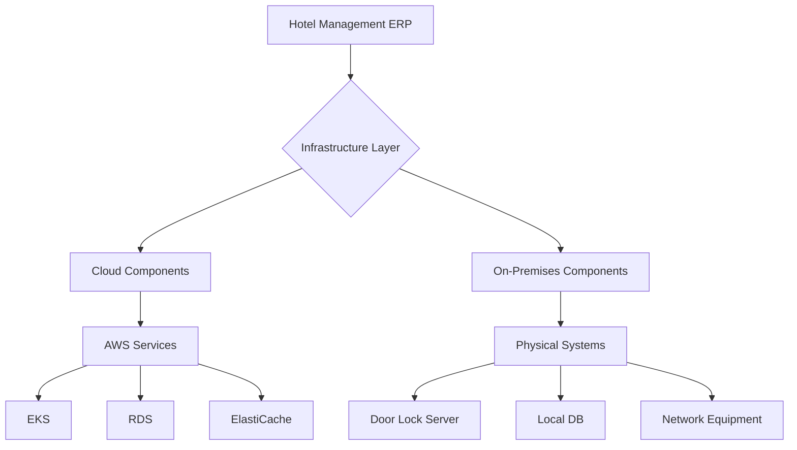
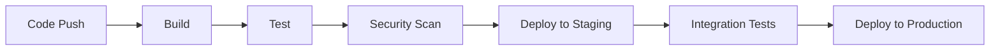

# Hotel Management ERP Infrastructure Documentation

![Security Classification: Internal Use Only]

## Table of Contents
- [Overview](#overview)
- [Prerequisites](#prerequisites)
- [AWS Infrastructure](#aws-infrastructure)
- [Kubernetes Setup](#kubernetes-setup)
- [Monitoring](#monitoring)
- [Security](#security)
- [Deployment](#deployment)
- [Maintenance](#maintenance)
- [Disaster Recovery](#disaster-recovery)
- [Cost Optimization](#cost-optimization)
- [Compliance](#compliance)
- [Troubleshooting](#troubleshooting)

## Overview

This document provides comprehensive documentation for the Hotel Management ERP system infrastructure. The system is built on a hybrid cloud architecture utilizing AWS services and on-premises components, designed for high availability, scalability, and security.

### Architecture Overview


## Prerequisites

### Required Tools
- AWS CLI v2.x
- kubectl v1.24+
- Terraform v1.5+
- Helm v3.x
- Docker v24+

### Access Requirements
- AWS IAM credentials with appropriate permissions
- Kubernetes cluster admin access
- VPN access to on-premises network
- SSH keys for bastion hosts

## AWS Infrastructure

### Resource Organization
```yaml
VPC:
  CIDR: 10.0.0.0/16
  Subnets:
    Public:
      - 10.0.1.0/24
      - 10.0.2.0/24
    Private:
      - 10.0.10.0/24
      - 10.0.11.0/24
    Database:
      - 10.0.20.0/24
      - 10.0.21.0/24
```

### EKS Cluster Configuration
```yaml
EKS:
  Version: 1.24
  NodeGroups:
    - Name: application
      InstanceType: t3.large
      MinSize: 3
      MaxSize: 10
    - Name: monitoring
      InstanceType: t3.xlarge
      MinSize: 2
      MaxSize: 4
```

## Kubernetes Setup

### Namespace Structure
```yaml
Namespaces:
  - hotel-prod
  - hotel-staging
  - monitoring
  - logging
  - security
```

### Resource Quotas
```yaml
ResourceQuota:
  pods: "100"
  requests.cpu: "20"
  requests.memory: 40Gi
  limits.cpu: "40"
  limits.memory: 80Gi
```

## Monitoring

### Stack Components
- Prometheus (v2.42.0)
- Grafana (v9.5.0)
- ELK Stack (v8.8.0)
- Jaeger (v1.42.0)

### Alert Thresholds
```yaml
Alerts:
  CPU:
    Warning: 70%
    Critical: 85%
  Memory:
    Warning: 75%
    Critical: 90%
  Disk:
    Warning: 75%
    Critical: 85%
```

## Security

### Security Layers
1. AWS WAF
2. Network Policies
3. Pod Security Policies
4. Encryption at Rest
5. TLS for Transit

### Access Control
```yaml
RBAC:
  Roles:
    - Admin
    - DevOps
    - Developer
    - Auditor
  ServiceAccounts:
    - prometheus
    - fluentd
    - argocd
```

## Deployment

### CI/CD Pipeline


### Deployment Procedures
1. Pre-deployment Checklist
2. Staging Deployment
3. Production Deployment
4. Rollback Procedures

## Maintenance

### Routine Tasks
- Daily backup verification
- Weekly security patches
- Monthly certificate rotation
- Quarterly DR drills

### Update Procedures
```yaml
Updates:
  Kubernetes:
    Frequency: Quarterly
    Window: Sunday 01:00-05:00 UTC
  Applications:
    Frequency: Bi-weekly
    Window: Saturday 22:00-02:00 UTC
```

## Disaster Recovery

### Recovery Objectives
- RPO: 15 minutes
- RTO: 1 hour

### Backup Strategy
```yaml
Backups:
  Database:
    Type: Automated snapshots
    Frequency: Every 6 hours
    Retention: 30 days
  Configuration:
    Type: Git repository
    Frequency: On change
    Retention: Indefinite
```

## Cost Optimization

### Resource Management
- Automatic scaling policies
- Spot instances for non-critical workloads
- Resource cleanup automation

### Monitoring and Budgeting
```yaml
Budgets:
  Production:
    Monthly: $15,000
    AlertThreshold: 80%
  Staging:
    Monthly: $5,000
    AlertThreshold: 90%
```

## Compliance

### Standards
- PCI DSS
- GDPR
- ISO 27001

### Audit Procedures
- Quarterly internal audits
- Annual external audits
- Continuous compliance monitoring

## Troubleshooting

### Common Issues
1. Pod scheduling failures
2. Network connectivity issues
3. Database performance problems
4. Authentication failures

### Debug Procedures
```yaml
Debugging:
  Logs:
    - kubectl logs
    - CloudWatch Logs
    - ELK Stack
  Metrics:
    - Prometheus queries
    - CloudWatch Metrics
    - Custom dashboards
```

---

Last Updated: [Technical Specifications version]  
Review Frequency: Monthly  
Security Classification: Internal Use Only  
Audience: DevOps Engineers and System Administrators