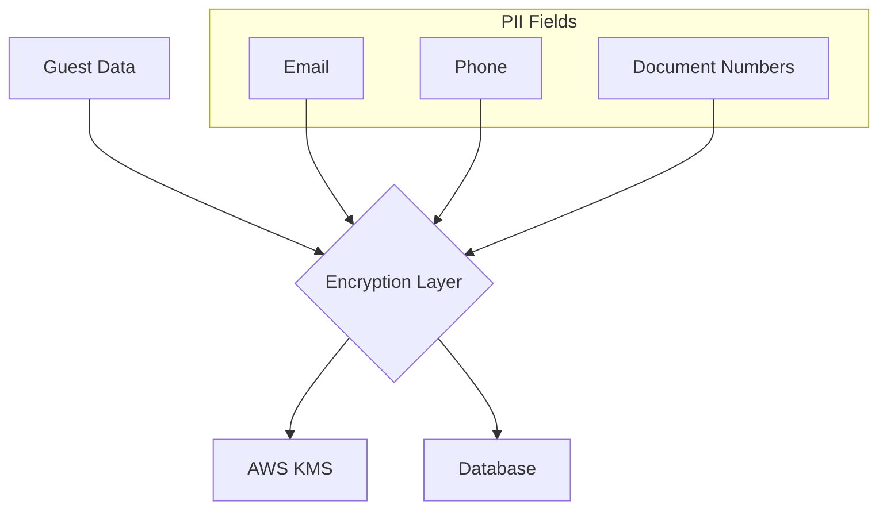

# Guest Service Microservice

## Overview

The Guest Service is a secure, GDPR-compliant microservice responsible for managing guest profiles in the Hotel Management ERP system. It implements comprehensive data protection measures including encryption, audit logging, and secure PII handling.

Version: 1.0.0  
Node.js Version: 18 LTS

## Key Features

- End-to-end encryption of PII data using AWS KMS
- GDPR-compliant data handling and retention policies
- Comprehensive audit logging of all operations
- Secure data masking in API responses
- Transaction-based operations with rollback support
- Reactive programming with RxJS for improved scalability

## Security Architecture

### Data Encryption



### Data Protection Measures

- AES-256 encryption for PII data
- AWS KMS for key management
- Automatic key rotation every 90 days
- Data masking in API responses
- Audit logging of all access attempts

## API Documentation

### Endpoints

#### Create Guest Profile
```typescript
POST /api/v1/guests
Content-Type: application/json
Authorization: Bearer <token>

{
  "firstName": "string",
  "lastName": "string",
  "email": "string",
  "phone": "string",
  "documentType": "PASSPORT | DRIVING_LICENSE | NATIONAL_ID",
  "documentNumber": "string",
  "preferences": {
    "language": "string",
    "dietaryRestrictions": "string[]",
    "roomPreferences": "string[]"
  }
}
```

#### Retrieve Guest Profile
```typescript
GET /api/v1/guests/:id
Authorization: Bearer <token>
```

#### Update Guest Profile
```typescript
PUT /api/v1/guests/:id
Content-Type: application/json
Authorization: Bearer <token>

{
  "phone": "string",
  "preferences": {
    "language": "string"
  }
}
```

#### Delete Guest Profile (GDPR Compliant)
```typescript
DELETE /api/v1/guests/:id
Authorization: Bearer <token>
```

## Data Model

### Guest Entity
```typescript
interface Guest {
  id: UUID;
  firstName: string;
  lastName: string;
  email: string;          // Encrypted
  phone: string;          // Encrypted
  documentType: string;
  documentNumber: string; // Encrypted
  preferences: GuestPreferences;
  createdAt: Date;
  updatedAt: Date;
  deletedAt?: Date;
  dataRetentionPolicy: 'GDPR_STANDARD' | 'EXTENDED_RETENTION';
}
```

## Security Configuration

### Environment Variables
```bash
# Required
AWS_KMS_KEY_ID=<aws-kms-key-id>
AWS_REGION=<aws-region>

# Optional
ENCRYPTION_KEY_ROTATION_DAYS=90
DATA_RETENTION_DAYS=730
```

## GDPR Compliance

### Data Subject Rights
- Right to Access: GET /api/v1/guests/:id/data-export
- Right to Rectification: PUT /api/v1/guests/:id
- Right to Erasure: DELETE /api/v1/guests/:id
- Right to Data Portability: GET /api/v1/guests/:id/data-export

### Data Retention
- Standard retention period: 2 years
- Extended retention (with consent): 5 years
- Automatic anonymization after retention period
- Secure hard deletion with audit trail

## Error Handling

```typescript
{
  "code": "ERROR_CODE",
  "message": "User-friendly error message",
  "details": {
    "field": "Additional context"
  },
  "timestamp": "ISO-8601 timestamp",
  "traceId": "Unique trace ID"
}
```

## Audit Logging

All operations are logged with:
- Operation type (CREATE, READ, UPDATE, DELETE)
- Timestamp
- User ID
- Affected resource ID
- Change details
- IP address
- Request context

## Dependencies

```json
{
  "@nestjs/common": "10.0.0",
  "@aws-sdk/client-kms": "3.0.0",
  "rxjs": "7.8.0",
  "prisma": "5.0.0",
  "zod": "3.21.4"
}
```

## Development Setup

1. Install dependencies:
```bash
pnpm install
```

2. Configure environment variables:
```bash
cp .env.example .env
```

3. Generate Prisma client:
```bash
pnpm prisma generate
```

4. Run migrations:
```bash
pnpm prisma migrate dev
```

5. Start development server:
```bash
pnpm start:dev
```

## Testing

```bash
# Unit tests
pnpm test

# Integration tests
pnpm test:e2e

# Security tests
pnpm test:security
```

## Production Deployment

1. Build the service:
```bash
pnpm build
```

2. Verify security configurations:
```bash
pnpm security:check
```

3. Deploy using Docker:
```bash
docker build -t guest-service .
docker run -p 3000:3000 guest-service
```

## Monitoring

- Health check endpoint: GET /health
- Metrics endpoint: GET /metrics
- AWS CloudWatch integration for operational metrics
- Prometheus-format metrics available

## Support

For security-related issues:
- Email: security@hotelerpapp.com
- Emergency: +1-555-0123

For technical support:
- Documentation: /docs
- API Reference: /api-docs
- Technical Support: support@hotelerpapp.com