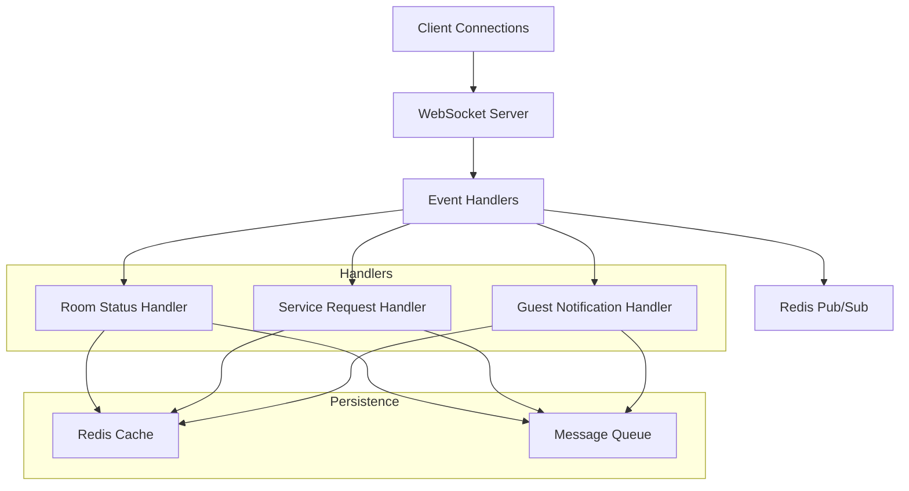

# WebSocket Service

## Overview

Enterprise-grade WebSocket service for real-time communication in the Hotel Management ERP system. This service handles critical real-time operations including room status updates, service requests, guest notifications, and staff alerts with high availability and scalability features.

Version: 1.0.0
Node.js Version: 18 LTS

## Features

### Real-time Event Handling
- Room status updates with priority queuing
- Service request routing with intelligent staff assignment
- Guest check-in/out notifications
- Housekeeping and maintenance alerts
- System-wide notifications and alerts

### Technical Capabilities
- Scalable WebSocket clusters with Redis pub/sub
- Circuit breaker pattern for fault tolerance
- Rate limiting and connection pooling
- SSL/TLS encryption support
- Comprehensive monitoring and logging

## Architecture

### Core Components


### Event Types
| Event | Direction | Purpose | Priority |
|-------|-----------|---------|----------|
| ROOM_STATUS_UPDATE | Bi-directional | Room status changes | High |
| SERVICE_REQUEST | Client->Server | Guest service requests | Medium |
| GUEST_CHECKIN | Server->Client | Guest arrival notifications | High |
| HOUSEKEEPING_ALERT | Server->Client | Cleaning notifications | Medium |
| SYSTEM_ALERT | Server->Client | System notifications | High |

## Setup

### Prerequisites
- Node.js 18 LTS
- Redis 7.0+
- SSL certificates (Production)
- Load balancer configuration
- Monitoring system integration

### Environment Variables
```bash
# Server Configuration
WS_PORT=3001
WS_PATH="/ws"
SSL_ENABLED=true
SSL_CERT_PATH="/path/to/cert"
SSL_KEY_PATH="/path/to/key"

# Redis Configuration
REDIS_HOST="localhost"
REDIS_PORT=6379
REDIS_PASSWORD="secret"
REDIS_TLS_ENABLED=true

# Security
MAX_CONNECTIONS=10000
RATE_LIMIT_PER_IP=100
MESSAGE_RETENTION_HOURS=24

# Monitoring
ENABLE_METRICS=true
METRICS_PORT=9090
```

### Installation
1. Configure SSL certificates (Production)
2. Set up Redis cluster
3. Configure environment variables
4. Install dependencies:
```bash
npm install ws@8.13.0 ioredis@5.3.0 winston@3.11.0
```
5. Start service:
```bash
npm run start:websocket
```

## Usage

### Connecting to WebSocket Server
```typescript
const ws = new WebSocket('wss://api.hotel.com/ws');

ws.onopen = () => {
  console.log('Connected to WebSocket server');
};

ws.onmessage = (event) => {
  const message = JSON.parse(event.data);
  handleWebSocketMessage(message);
};
```

### Message Format
```typescript
interface WebSocketMessage<T> {
  event: WebSocketEvents;
  namespace: WebSocketNamespaces;
  payload: T;
  timestamp: Date;
  messageId: string;
  correlationId: string;
  sender: string;
  priority: MessagePriority;
}
```

### Event Handling Example
```typescript
ws.addEventListener('message', (event) => {
  const message = JSON.parse(event.data);
  
  switch (message.event) {
    case WebSocketEvents.ROOM_STATUS_UPDATE:
      handleRoomStatusUpdate(message.payload);
      break;
    case WebSocketEvents.SERVICE_REQUEST:
      handleServiceRequest(message.payload);
      break;
    // Handle other events...
  }
});
```

## Security

### Authentication
- JWT token validation
- Role-based access control
- Connection authentication timeout

### Rate Limiting
- Per-IP connection limits
- Message rate throttling
- Automatic blacklisting

### Encryption
- TLS 1.3 required in production
- Message payload encryption
- Secure key rotation

## Monitoring

### Metrics
- Active connections
- Message throughput
- Event processing latency
- Error rates
- Circuit breaker status

### Health Checks
- WebSocket server status
- Redis connection health
- Memory usage
- Connection pool status

### Logging
```typescript
// Structured logging format
{
  timestamp: '2023-11-14T10:00:00Z',
  level: 'info',
  event: 'room_status_update',
  correlationId: '123e4567-e89b-12d3-a456-426614174000',
  message: 'Room status updated successfully',
  metadata: {
    roomNumber: '101',
    newStatus: 'CLEANED',
    priority: 'HIGH'
  }
}
```

## Error Handling

### Circuit Breaker Configuration
```typescript
const circuitBreakerOptions = {
  timeout: 5000,          // 5 seconds
  errorThresholdPercentage: 50,
  resetTimeout: 30000,    // 30 seconds
  volumeThreshold: 10
};
```

### Recovery Strategies
- Automatic reconnection
- Message queue persistence
- Failover to backup servers
- Graceful degradation

## Performance Optimization

### Connection Pooling
- Maximum connections: 10,000
- Idle connection timeout: 60 seconds
- Connection keep-alive

### Message Handling
- Message compression
- Batch processing
- Priority queuing
- Cache optimization

## Contributing

### Development Setup
1. Clone repository
2. Install dependencies
3. Configure local environment
4. Run tests:
```bash
npm run test:websocket
```

### Code Standards
- TypeScript strict mode
- ESLint configuration
- Prettier formatting
- Jest test coverage > 80%

## License
Proprietary - All rights reserved