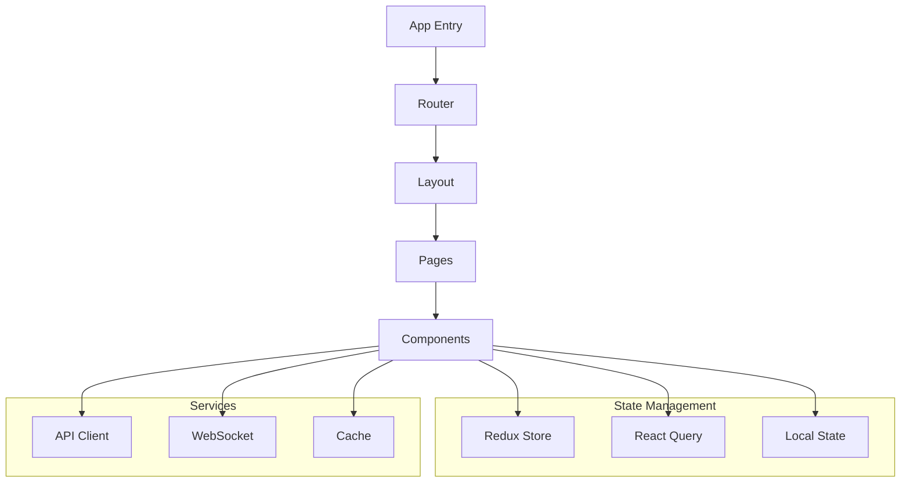

# Hotel Management System Frontend

Enterprise-grade React application for managing hotel operations with real-time updates, offline support, and accessibility compliance.

## Table of Contents
- [Overview](#overview)
- [Getting Started](#getting-started)
- [Architecture](#architecture)
- [Development Guidelines](#development-guidelines)
- [Component Library](#component-library)
- [Testing](#testing)

## Overview

### Key Features
- Enterprise-grade React application with TypeScript
- Microservices architecture integration
- Real-time updates and offline support
- Multi-language and theme support
- WCAG 2.1 AA accessibility compliance
- Performance-optimized architecture
- Comprehensive security implementation

### Tech Stack
- React 18.2.0
- TypeScript 5.0.0
- Redux Toolkit 1.9.5
- React Query 4.29.0
- Material UI 5.14.0
- Jest 29.5.0
- Cypress 12.0.0

## Getting Started

### Prerequisites
- Node.js 18 LTS or higher
- pnpm 8+ package manager
- VS Code (recommended IDE)

### Required VS Code Extensions
- ESLint
- Prettier
- TypeScript and JavaScript Language Features
- Material Icon Theme
- GitLens

### Installation

1. Clone the repository:
```bash
git clone <repository-url>
cd hotel-management-system/src/web
```

2. Install dependencies:
```bash
pnpm install
```

3. Create environment configuration:
```bash
cp .env.example .env.local
```

4. Start development server:
```bash
pnpm dev
```

### Available Scripts

| Command | Description |
|---------|-------------|
| `pnpm dev` | Start development server with hot reload |
| `pnpm build` | Create optimized production build |
| `pnpm test` | Run Jest test suite with coverage |
| `pnpm lint` | Run ESLint and StyleLint checks |
| `pnpm type-check` | Run TypeScript compiler checks |

## Architecture

### Frontend Architecture Overview



### State Management
- Redux Toolkit for global application state
- React Query for server state management
- Local state for component-specific data
- WebSocket integration for real-time updates

### Data Flow
1. Component triggers action
2. Action processed through middleware
3. State updates propagate to subscribers
4. UI updates reflect new state

## Development Guidelines

### Code Style

- Follow Airbnb React/JSX Style Guide
- Use TypeScript strict mode
- Implement proper error boundaries
- Follow React hooks best practices
- Maintain consistent file structure

### Component Development

```typescript
// Component Template
import { FC, ReactNode } from 'react';
import { styled } from '@mui/material/styles';

interface Props {
  children?: ReactNode;
  // Add component props
}

const StyledComponent = styled('div')(({ theme }) => ({
  // Add styled-components styles
}));

export const Component: FC<Props> = ({ children }) => {
  return (
    <StyledComponent>
      {children}
    </StyledComponent>
  );
};
```

### File Structure

```
src/
├── assets/          # Static assets
├── components/      # Reusable components
├── config/          # Configuration files
├── features/        # Feature-based modules
├── hooks/           # Custom React hooks
├── layouts/         # Layout components
├── pages/           # Route components
├── services/        # API and external services
├── store/           # Redux store configuration
├── styles/          # Global styles
├── types/           # TypeScript definitions
└── utils/           # Utility functions
```

## Component Library

### Core Components
- Layout components (Container, Grid, Box)
- Navigation (AppBar, Drawer, Menu)
- Forms (Input, Select, DatePicker)
- Feedback (Alert, Snackbar, Progress)
- Data Display (Table, Card, List)

### Usage Example

```typescript
import { Box, Typography, Button } from '@mui/material';

const ExampleComponent = () => {
  return (
    <Box sx={{ p: 2 }}>
      <Typography variant="h1">Hotel Management</Typography>
      <Button variant="contained">Check In</Button>
    </Box>
  );
};
```

## Testing

### Testing Strategy

1. Unit Tests
   - Component rendering
   - Business logic
   - State management
   - Custom hooks

2. Integration Tests
   - Feature workflows
   - API integration
   - State interactions

3. E2E Tests
   - Critical user paths
   - Cross-browser compatibility
   - Performance benchmarks

### Example Test

```typescript
import { render, screen } from '@testing-library/react';
import { ExampleComponent } from './ExampleComponent';

describe('ExampleComponent', () => {
  it('renders correctly', () => {
    render(<ExampleComponent />);
    expect(screen.getByText('Hotel Management')).toBeInTheDocument();
  });
});
```

### Coverage Requirements
- Statements: 80%
- Branches: 75%
- Functions: 80%
- Lines: 80%

## Performance Optimization

- Code splitting with React.lazy
- Image optimization
- Memoization of expensive computations
- Virtual scrolling for large lists
- Service Worker for offline support

## Security Considerations

- CSRF protection
- XSS prevention
- Content Security Policy
- Secure authentication flow
- Input sanitization
- Regular dependency audits

## Contributing

1. Follow Git flow branching model
2. Write descriptive commit messages
3. Include tests with new features
4. Update documentation
5. Submit PR for review

## License

Copyright © 2023 Hotel Management System. All rights reserved.